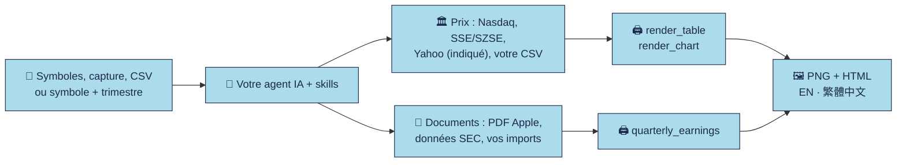

<div align="center">


**Tableaux façon étude, graphiques de cours et analyses de résultats trimestriels pour votre agent IA.**

[English](README.md) · [繁體中文](README.zh-Hant.md) · [日本語](README.ja.md) · **Français**

<p><a href="LICENSE"></a> <a href="https://github.com/imoneys10k/schwab-table/actions/workflows/install-test.yml"></a> <a href="https://github.com/imoneys10k/schwab-table/actions/workflows/tests.yml"></a> <a href="https://github.com/imoneys10k/schwab-table/releases"></a> <a href="https://github.com/imoneys10k/schwab-table/stargazers"></a>   </p>

<p><a href="#-installation"><b>🚀 Installation</b></a> · <a href="#-galerie"><b>🎨 Galerie</b></a> · <a href="https://imoneys10k.github.io/schwab-table/"><b>🌐 Site du projet</b></a> · <a href="https://imoneys10k.github.io/schwab-table/earnings/"><b>🧾 Démo résultats</b></a> · <a href="SKILL.en.md"><b>📘 Doc du skill</b></a></p>

</div>

Deux skills d'agent dans un seul dépôt, conçus pour Claude Code et utilisables avec Codex et d'autres agents de programmation. **schwab-performance-table** transforme une liste d'actions, une capture de positions chez un courtier, des données de prix ou vos propres fichiers CSV en tableaux façon étude (dispositions Schwab, Morgan, Blackstone et IBKR) et en graphiques de cours avec drawdown et échelle logarithmique. **quarterly-earnings-review** vérifie le document trimestriel d'une société et produit un tableau de résultats de style HSBC avec des commentaires sourcés. Tout est produit en anglais et en chinois traditionnel, en PNG et en HTML autonome.

## ✨ Points forts

<table>
<tr><td width="50%" valign="top"><h3>🎯 Quatre dispositions de rapport</h3><p>Styles Schwab, Morgan, Blackstone et IBKR, avec des schémas de colonnes explicites. Ce sont des modèles indépendants, pas des rapports publiés par ces institutions.</p></td><td width="50%" valign="top"><h3>📊 Tableaux, graphiques, résultats</h3><p>Tableaux de classement, de positions et de liste de suivi ; courbes et petits multiples avec drawdown et échelle logarithmique ; résultats trimestriels de style HSBC.</p></td></tr>
<tr><td width="50%" valign="top"><h3>🌏 Anglais et chinois traditionnel</h3><p>Chaque sortie existe dans les deux langues : PNG en 2x et HTML autonome, avec thème sombre et PDF en option.</p></td><td width="50%" valign="top"><h3>🔒 Sources toujours indiquées</h3><p>Cours des bourses Nasdaq et Shanghai/Shenzhen, données Yahoo clairement identifiées pour les autres marchés, documents SEC et Apple pour les résultats. Une donnée manquante est marquée NA, jamais inventée.</p></td></tr>
<tr><td width="50%" valign="top"><h3>🤖 Installation en une phrase</h3><p>Collez un message dans Claude Code ou Codex. Fonctionne sous macOS, Linux et Windows et installe les deux skills.</p></td><td width="50%" valign="top"><h3>🧪 Testé</h3><p>Tests unitaires à réponses connues, CI sur trois systèmes, test de fumée sur données réelles et première série d'évaluations d'agent.</p></td></tr>
</table>

## 🎨 Galerie

<table>
<tr><td width="50%" align="center"><br><sub><b>Tableau de classement</b> · EN</sub></td><td width="50%" align="center"><br><sub><b>Tableau de liste de suivi</b> · 繁體中文</sub></td></tr>
<tr><td width="50%" align="center"><br><sub><b>Courbes avec drawdown</b> · EN</sub></td><td width="50%" align="center"><br><sub><b>Petits multiples, échelle log</b> · 繁體中文</sub></td></tr>
<tr><td width="50%" align="center"><br><sub><b>Matrice façon Morgan</b> · 繁體中文</sub></td><td width="50%" align="center"><br><sub><b>Performance façon Blackstone</b> · 繁體中文</sub></td></tr>
<tr><td width="50%" align="center"><br><sub><b>Positions façon IBKR</b> · 繁體中文</sub></td><td width="50%" align="center"><br><sub><b>Résultats HSBC, AAPL T3</b> · 繁體中文</sub></td></tr>
<tr><td width="50%" align="center"><br><sub><b>Résultats HSBC, AAPL T4</b> · 繁體中文</sub></td><td width="50%" align="center"><br><sub><b>Tableau de positions</b> · EN</sub></td></tr>
</table>

<sub>Les exemples de résultats utilisent les publications officielles d'Apple et le tableau de classement un graphique public de Charles Schwab. Tout le reste utilise des sociétés fictives et des données synthétiques.</sub>

## 🔄 Fonctionnement



## 🚀 Installation

Fonctionne sous macOS, Linux et Windows. Python 3.9 ou supérieur est nécessaire (pour produire les rendus) ; git est facultatif. L'installateur enregistre les deux skills.

💡 **Le plus simple :** collez le message ci-dessous dans votre agent IA, il installe tout pour vous.

### 🤖 Laissez votre agent IA l'installer

Collez ce message dans Claude Code, Codex ou tout autre agent de programmation :

```text
Installe pour moi les skills de https://github.com/imoneys10k/schwab-table.
Détecte d'abord mon système d'exploitation. Sous macOS ou Linux, exécute :
  curl -fsSL https://raw.githubusercontent.com/imoneys10k/schwab-table/main/install.sh | sh
Sous Windows, dans PowerShell, exécute :
  irm https://raw.githubusercontent.com/imoneys10k/schwab-table/main/install.ps1 | iex
Si j'utilise un autre agent que Claude, installe-les plutôt dans le dossier skills de cet agent
(macOS/Linux : ajoute `--dir <chemin>` après `sh -s --` ; Windows : enregistre install.ps1 et lance-le avec -Dir <chemin>).
Une fois terminé, vérifie que « Render OK » s'est affiché, puis dis-moi de redémarrer pour que les skills soient chargés.
```

### 💻 Ou lancez-le vous-même

macOS / Linux:

```bash
curl -fsSL https://raw.githubusercontent.com/imoneys10k/schwab-table/main/install.sh | sh
```

Windows (PowerShell):

```powershell
irm https://raw.githubusercontent.com/imoneys10k/schwab-table/main/install.ps1 | iex
```

L'installateur place le skill principal dans `~/.claude/skills/schwab-performance-table` (`%USERPROFILE%\.claude\skills\...` sous Windows), crée un environnement virtuel Python dédié à l'intérieur, installe les dépendances et Chromium (environ 100 Mo), enregistre `quarterly-earnings-review` à côté, puis génère tous les styles de tableau, un graphique et un tableau de résultats comme test de fumée. Il affiche `Render OK` quand tout fonctionne. Redémarrez ensuite votre agent (Claude, Codex, ...) pour que les skills soient pris en compte. Pour lire un script avant de l'exécuter, ouvrez [install.sh](install.sh) ou [install.ps1](install.ps1).

| Option (macOS / Linux) | Option (Windows) | Effet |
|---|---|---|
| `--dir PATH` | `-Dir PATH` | Installer ailleurs (par exemple dans le dossier skills d'un autre agent). La variable `CLAUDE_SKILLS_DIR` change la racine par défaut. |
| `--ref TAG` | `-Ref TAG` | Installer un tag ou une branche au lieu de `main`, par exemple `v0.6.1`, pour figer une version. Relancez sans cette option pour revenir à `main`. |
| `--skip-deps` | `-SkipDeps` | Ignorer Python, Playwright et Chromium (récupérer et enregistrer seulement les fichiers). |
| `--uninstall` | `-Uninstall` | Supprimer le dossier du skill installé et le skill de résultats qu'il a enregistré. |

Avec un tube (pipe), passez les options après `sh -s --`, par exemple `curl -fsSL .../install.sh | sh -s -- --dir ~/my-skills/schwab`. Sous Windows, enregistrez `install.ps1` puis lancez `.\install.ps1 -Dir C:\path`.

**Mise à jour :** relancez la même commande. **Désinstallation :** lancez-la avec `--uninstall` (`-Uninstall` sous Windows).

**Dépannage :** sous Debian/Ubuntu, installez d'abord `python3-venv`. Sous Linux, si Chromium ne démarre pas, exécutez `sudo <dossier d'installation>/.venv/bin/python -m playwright install-deps chromium`. Sur un serveur Linux minimal, installez aussi une police CJK (`sudo apt install fonts-noto-cjk`), sinon le chinois s'affiche en carrés.

## 💬 Utilisation avec votre agent

Une fois installé, il suffit de demander en langage naturel, par exemple :

- Fais-moi un tableau de performance pour NVDA, AMD et MU.
- Transforme cette capture d'écran de positions en tableau de style Schwab. (joindre la capture)
- Trace NVDA, MU et AAPL depuis le début de l'année face au S&P 500.
- Compare ces six actions de mars à juin en échelle logarithmique.
- Présente AAPL, MSFT et NVDA dans une matrice rendement/risque façon Morgan.
- Trace 7203.T, 0700.HK et 600519.SS depuis le début de l'année.
- Analyse les résultats AAPL FY2025Q3 dans un tableau de style HSBC.

## 🧩 Styles de tableau

Quatre dispositions, choisies avec `--style` (ou `spec.style` ; Schwab par défaut). Ce sont des modèles indépendants, pas des rapports publiés par les institutions citées ni liés à elles.

| Style | Contenu | Exemple |
|---|---|---|
| Schwab · classement | YTD et rang dans le S&P 500 et le NASDAQ (mode A) | [EN](examples/neural9_en.png) · [繁體中文](examples/neural9_zh.png) |
| Schwab · positions | Gain/perte latent en %, gain/perte du jour, coût moyen, nombre de titres, à partir d'une capture ou d'un export (mode B) | [EN](examples/holdings_en.png) · [繁體中文](examples/holdings_zh.png) |
| Schwab · liste de suivi | Uniquement des symboles : YTD, 1 mois, 1 an, dernier cours (mode C) | [EN](examples/watchlist_en.png) · [繁體中文](examples/watchlist_zh.png) |
| Morgan | Deux périodes × rendement, volatilité et drawdown | [EN](examples/morgan_en.png) · [繁體中文](examples/morgan_zh.png) |
| Blackstone | Groupes par secteur ou stratégie, deux périodes de rendement | [EN](examples/blackstone_en.png) · [繁體中文](examples/blackstone_zh.png) |
| IBKR | Champs du courtier, valeurs de marché, poids et exposition fournie | [EN](examples/ibkr_en.png) · [繁體中文](examples/ibkr_zh.png) |

```bash
python3 render_table.py examples/watchlist_spec.json out/watchlist     # Schwab (par défaut)
python3 render_table.py examples/morgan_spec.json out/matrix           # ou --style morgan | blackstone | ibkr
python3 prices_to_table.py data/prices.json data/matrix.json --style morgan   # construire une matrice à partir des prix récupérés
python3 render_table.py data/matrix.json out/matrix
```

Chaque modèle a des schémas de colonnes explicites ; passer un tableau de suivi à cinq colonnes à une disposition de sept ou neuf colonnes n'invente pas les données manquantes. Les tableaux et graphiques Schwab gardent les modes clair et sombre ; les autres modèles sont calibrés pour du papier blanc. Schémas, échantillons de sources et substitutions de polices : voir le [guide des modèles](references/institutional-tables.md).

## 📊 Graphiques de cours

Jusqu'à 9 valeurs sur une période au choix (par défaut : depuis le début de l'année), avec un panneau de drawdown et un tableau de synthèse.

| Disposition | Contenu | Pour |
|---|---|---|
| `lines` | Courbes, panneau de drawdown, tableau de synthèse | 2 à 5 valeurs |
| `multiples` | Un petit graphique par valeur à échelle commune, avec une bande de drawdown dessous | 6 à 9 valeurs |

`layout: auto` choisit selon le nombre de valeurs.

| Symboles | Source | Remarques |
|---|---|---|
| Actions US, ETF, indices Nasdaq (`NVDA`, `BRK.B`, `SPY`, `COMP`) | Cours de clôture officiels Nasdaq | Rendement de prix ajusté des divisions de titres, environ 10 ans d'historique |
| Shanghai / Shenzhen (`600519.SS`, `000001.SZ`) | Sites des bourses | Cours non ajustés ; l'historique de Shenzhen est limité |
| Autres bourses et indices (`7203.T`, `0700.HK`, `SAP.DE`, `^N225`) | Yahoo Finance | Clairement indiqué comme donnée agrégée ; utilisez le suffixe de la bourse |
| Vos propres fichiers | `csv_to_prices.py` | Tout marché ; un CSV de cours ajustés donne un graphique de rendement total clairement étiqueté |

- **Référence :** SPY par défaut (indiqué comme substitut du S&P 500), jusqu'à deux références (`--benchmark SPY,COMP`), ou `--benchmark none`.
- **Axe :** un seul axe vertical, indexé à 100 au départ. Il passe automatiquement en échelle logarithmique quand l'écart est grand (ou fixez `y_scale`).
- **Options :** `--theme dark`, `--pdf`, couleurs de courbes personnalisées et infobulles au survol dans les fichiers HTML.

```bash
python3 fetch_prices.py NVDA MU AAPL --start 2026-01-01 -o data/watch.json
python3 fetch_prices.py 7203.T 0700.HK SAP.DE 600519.SS --start 2026-08-01 --benchmark none -o data/global.json
python3 render_chart.py examples/chart_lines_spec.json out/chart
```

## 🧾 Analyse des résultats trimestriels

Demandez « Analyse les résultats AAPL FY2025Q3 dans un tableau de style HSBC ». Le skill **quarterly-earnings-review** vérifie les dates de l'exercice et le document d'origine, calcule les valeurs du trimestre, en glissement annuel et par rapport au trimestre précédent, et ajoute des commentaires qui citent leurs sources. La sortie est un PNG + HTML en anglais et en chinois traditionnel, avec les faits bruts et un registre de vérification.

- **Sources :** PDF financiers officiels d'Apple (vérifiés sur pièces pour FY2025Q3 et FY2025Q4) ; autres sociétés US-GAAP via SEC Company Facts (l'analyseur est couvert par des jeux de test fixes, l'accès en direct peut être refusé) ; autres marchés via des rapports officiels vérifiés importés avec `--facts`.
- **Trimestres fiscaux, pas civils :** le tableau indique les vraies dates de la période. Un chiffre annuel ou cumulé n'est jamais présenté comme un fait trimestriel ; une donnée manquante reste NA.
- **Commentaires :** chaque commentaire cite un identifiant du registre des sources. Aucune affirmation de dépassement ou de déception sans preuve du consensus ; l'analyse n'écrase jamais les faits.

```bash
python3 quarterly_earnings.py AAPL --period FY2025Q3 -o out/aapl_q3
```

[Démo en ligne sur deux trimestres](https://imoneys10k.github.io/schwab-table/earnings/) · [Usage et couverture des sources](EARNINGS.md) (en chinois traditionnel) · [Skill](skills/quarterly-earnings-review/SKILL.md)

## 🔍 Règles sur les données et l'honnêteté

- **Les sources sont toujours imprimées** en note de bas de tableau, avec la date de référence et la date de récupération. Un historique indisponible est signalé, jamais raccourci en silence.
- **`null` n'est pas zéro.** Une donnée manquante s'affiche `NA` ; rien n'est complété de mémoire ni deviné.
- **Rendement de prix seulement pour les sources automatiques.** Les montants de dividendes de Nasdaq ne sont pas ajustés des divisions de titres et les ETF n'en ont pas ; le rendement total demande donc votre propre CSV de cours ajustés.
- **Yahoo est indiqué comme donnée agrégée**, pas comme cours publiés par la bourse. Les prix des sites des bourses chinoises ne sont pas ajustés ; les outils avertissent des distorsions dues aux opérations sur titres.
- **Hong Kong et les autres marchés demandent le suffixe de la bourse** (`0700.HK`) ; un code purement numérique est ambigu et refusé.
- Les détails pour les agents sont dans [SKILL.md](SKILL.md) (chinois traditionnel) et [SKILL.en.md](SKILL.en.md) (anglais).

<details>
<summary><b>📁 Fichiers</b></summary>

- `SKILL.md`, `SKILL.en.md`: Le skill chargé par Claude (chinois traditionnel) et sa traduction anglaise
- `skills/quarterly-earnings-review/`: Le skill de résultats, enregistré à côté du skill principal par les installateurs
- `install.sh`, `install.ps1`, `install_earnings_skill.py`: Installateurs en une commande pour macOS / Linux et Windows, et enregistrement du skill de résultats
- `render_table.py`, `institutional_tables.py`, `prices_to_table.py`: Moteur de rendu des tableaux et ses quatre styles ; construit des spécifications Morgan / Blackstone à partir des prix
- `fetch_prices.py`, `csv_to_prices.py`: Cours de clôture quotidiens de Nasdaq, Shanghai/Shenzhen et Yahoo ; conversion de vos fichiers CSV
- `render_chart.py`, `render_common.py`: Moteur de rendu des graphiques ; thèmes et sorties PNG / PDF partagés
- `quarterly_earnings.py`, `earnings_core.py`, `earnings_sources.py`, `render_earnings.py`: Commande de résultats, calculs vérifiables, adaptateurs de sources et rendu de style HSBC
- `localization.py`, `fonts.py`, `fonts/`: Conversion en chinois traditionnel ; polices fournies et intégrées au HTML (licences incluses)
- `references/`, `EARNINGS.md`: Guide des modèles ; usage et couverture des sources pour les résultats (chinois traditionnel)
- `examples/`, `docs/`: Spécifications et rendus d'exemple (`sample_prices.json` est synthétique) ; le site GitHub Pages
- `tests/`, `evals/`: Tests unitaires ; demandes d'agent réalistes, jeu de tests de déclenchement et résultats
- `tools/build_docs.py`: Génère ces README et le site à partir d'une seule table de contenu
- `requirements.txt`, `CHANGELOG.md`, `CONTRIBUTING.md`, `assets/`: Dépendances, historique, règles de contribution, bannière et carte sociale

</details>

<details>
<summary><b>🔧 Rendu manuel</b></summary>

Si vous avez utilisé l'installateur, les scripts basculent automatiquement sur leur environnement virtuel : `python3 render_table.py ...` suffit. Sinon, Python 3.9 ou supérieur est requis :

```bash
pip install -r requirements.txt && playwright install chromium
python3 render_table.py examples/neural9_spec.json out/neural9
python3 render_table.py examples/morgan_spec.json out/matrix
python3 fetch_prices.py NVDA MU AAPL --start 2026-01-01 -o data/watch.json
python3 render_chart.py examples/chart_lines_spec.json out/chart --theme dark --pdf
python3 csv_to_prices.py 0700.HK=tencent.csv --benchmark HSI=hsi.csv -o data/hk.json
python3 quarterly_earnings.py AAPL --period FY2025Q3 -o out/aapl_q3
```

Options des deux moteurs : `--langs en` ne rend que les langues indiquées (séparées par des virgules ; `zh` est le chinois traditionnel et les noms `_zh` sont conservés), `--no-png` n'écrit que le HTML sans navigateur, `--scale 3` augmente la résolution des PNG (2 par défaut, soit 1520 px de large), `--theme dark` et `--pdf`. Les dossiers de sortie manquants sont créés.

`fetch_prices.py` met les réponses en cache jusqu'à 12 heures (`--refresh` l'ignore) et ne réutilise un cache que s'il contient déjà la dernière clôture attendue. En cas d'échec réseau, il reprend le dernier cache avec un avertissement. `index:COMP` / `etf:SPY` forcent la classe d'actif quand un code est ambigu. Les graphiques se font en deux étapes : récupérer, puis rendre ; indiquez la période avec `--start` / `--end`.

Polices : Inter, Source Sans 3 et Droid Sans sont fournies et intégrées pour les caractères latins ; le chinois utilise la police système en chinois traditionnel. Les substitutions par rapport aux polices d'origine sont documentées dans le [guide des modèles](references/institutional-tables.md). Les polices propriétaires des PDF de référence ou de macOS ne sont pas distribuées.

</details>

## 🧪 Tests et évaluations

`python3 -m unittest discover -s tests -v` exécute des tests à réponses connues pour les rendements, le drawdown, la volatilité, le routage des symboles, la fraîcheur du cache, l'import CSV, les styles de tableau et les calculs de résultats. La CI les exécute sous Ubuntu, macOS et Windows (Python 3.9 et 3.13), régénère les exemples pour vérifier qu'ils n'ont pas changé, lance un test de fumée en direct sur Nasdaq et installe les skills sur les trois systèmes. [evals/](evals/README.md) contient des demandes d'agent réalistes et les premiers résultats. Les README et le site sont générés par `python3 tools/build_docs.py`, et un test échoue s'ils sont périmés.

## 📌 Avertissement

Ce projet met en forme des données et ne fournit aucun conseil en investissement. Sauf indication contraire dans la note de la galerie, les exemples utilisent des sociétés fictives et des valeurs synthétiques. Les dispositions de rapport sont des modèles indépendants, pas des rapports publiés par les institutions citées.

## 📄 Licence

[MIT](LICENSE)

<div align="center"><sub>⭐ Si cela vous fait gagner du temps, une étoile aide d'autres personnes à le trouver.</sub></div>
