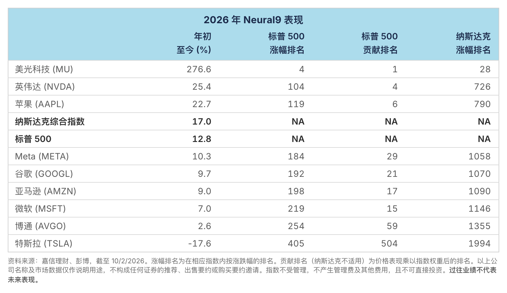
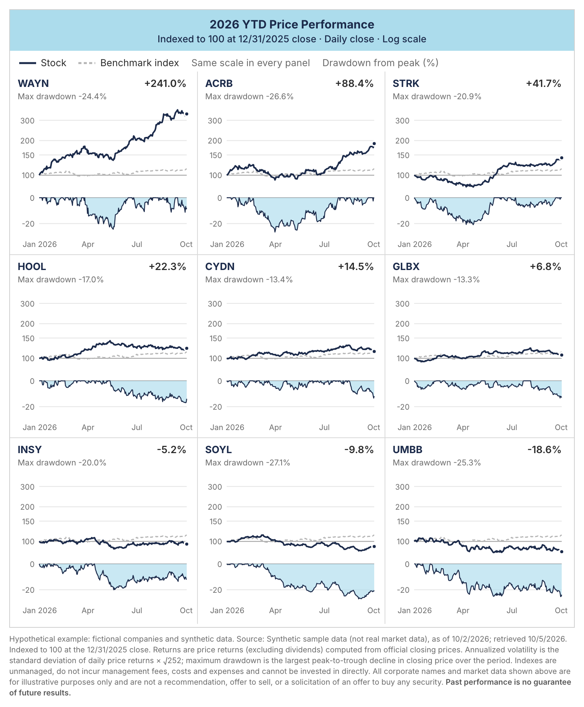

[English](README.md) · [简体中文](README.zh-CN.md) · [日本語](README.ja.md) · **Français**

# schwab-table

[](LICENSE) [](https://github.com/imoneys10k/schwab-table/actions/workflows/install-test.yml)

Un Claude Skill qui transforme une liste d'actions, une capture d'écran de positions chez un courtier ou des données de performance/classement déjà prêtes en un tableau de performance dans le style des études de Charles Schwab, et qui trace dans le même style l'évolution de plusieurs valeurs sur une période au choix. Tout est produit en chinois et en anglais (PNG + HTML).




## Trois modes

| Mode | Entrée | Colonnes 2 à 5 | Exemple |
|---|---|---|---|
| A. Tableau de classement | Le rendement depuis le début de l'année (YTD) de chaque action et son rang dans le S&P 500 / NASDAQ | YTD, rang de performance S&P 500, rang de contribution S&P 500, rang de performance NASDAQ | [EN](examples/neural9_en.png) · [中文](examples/neural9_zh.png) |
| B. Tableau de positions | Une capture d'écran ou un export de positions chez un courtier | Gain/perte latent en %, gain/perte du jour, coût moyen, nombre de titres | [EN](examples/holdings_en.png) · [中文](examples/holdings_zh.png) |
| C. Tableau de liste de suivi | Uniquement des symboles boursiers | YTD, 1 mois, 1 an, dernier cours de clôture | [EN](examples/watchlist_en.png) · [中文](examples/watchlist_zh.png) |

Le mode A utilise les données d'un graphique public de Charles Schwab. Les exemples des modes B et C reposent sur des sociétés fictives et des chiffres inventés, à titre d'illustration uniquement.

## Graphiques de cours

Jusqu'à 9 valeurs sur une période au choix (par défaut : depuis le début de l'année), dans le même style d'étude, avec un panneau de drawdown et un tableau de synthèse. Versions chinoise et anglaise, PNG + HTML. Les exemples utilisent des sociétés fictives et des données synthétiques.




| Disposition | Contenu | Pour |
|---|---|---|
| `lines` | Courbes, panneau de drawdown, tableau de synthèse | 2 à 5 valeurs |
| `multiples` | Un petit graphique par valeur à échelle commune, avec une bande de drawdown dessous | 6 à 9 valeurs |

`layout: auto` choisit selon le nombre de valeurs.

- **Données :** l'API officielle d'historique de cours de Nasdaq : cours de clôture quotidiens officiels, ajustés des divisions de titres, rendements de prix, environ 10 ans. La référence par défaut est SPY, indiquée comme substitut du S&P 500. Aucune autre source n'est utilisée.
- **Axe :** un seul axe vertical, indexé à 100 au départ. Il passe automatiquement en échelle logarithmique quand l'écart est grand (ou fixez `y_scale` vous-même).

```bash
python3 fetch_prices.py NVDA MU AAPL --start 2026-01-01 -o data/watch.json
python3 render_chart.py examples/chart_lines_spec.json out/chart   # copy and edit the spec for your own data
```

## Utilisation avec Claude

Une fois installé, il suffit de demander en langage naturel, par exemple :

- Fais-moi un tableau de performance pour NVDA, AMD et MU.
- Transforme cette capture d'écran de positions en tableau de style Schwab. (joindre la capture)
- Fais un tableau de classement Neural9 2026 à partir de ces données.
- Trace le cours de NVDA, MU et AAPL depuis le début de l'année.
- Compare ces six actions de mars à juin en échelle logarithmique.

## Sources de données

Uniquement des données faisant autorité : cours de clôture officiels des bourses, fournisseurs d'indices (S&P Dow Jones Indices, Nasdaq Global Indexes, éventuellement via FRED), communications aux investisseurs des entreprises et documents déposés à la SEC, ou données de courtier de l'utilisateur. Les rendements sont calculés à partir des cours de clôture officiels ; les variations déjà calculées par des sites agrégateurs ne sont pas utilisées. Les règles détaillées sont dans [SKILL.md](SKILL.md) (en chinois) ; une traduction anglaise est disponible dans [SKILL.en.md](SKILL.en.md).

## Fichiers

- `SKILL.md` : la définition du skill chargée par Claude (structure, paramètres visuels, règles sur les sources de données, liste de contrôle), en chinois
- `SKILL.en.md` : traduction anglaise de `SKILL.md`, pour les lecteurs humains
- `install.sh` / `install.ps1` : installateurs en une commande (macOS / Linux et Windows)
- `render_table.py` : le moteur de rendu des tableaux. Il lit une spécification JSON et produit des fichiers HTML en chinois et en anglais ainsi que des PNG en 2x
- `fetch_prices.py` : télécharge les cours de clôture quotidiens depuis l'API officielle de Nasdaq (bibliothèque standard uniquement)
- `render_chart.py` : le moteur de rendu des graphiques. Il lit les prix téléchargés et une spécification JSON
- `fonts.py`, `fonts/` : la police Inter fournie (SIL OFL), intégrée à chaque fichier HTML
- `requirements.txt` : dépendance Python (Playwright)
- `examples/` : une spécification et son rendu pour chacun des trois modes de tableau et les deux dispositions de graphique (`sample_prices.json` est synthétique)
- `assets/` : image d'aperçu social

## Installation

Fonctionne sous macOS, Linux et Windows. Python 3.9+ est nécessaire (pour produire les tableaux) ; git est facultatif.

### Laissez votre agent IA l'installer

Collez ce message dans Claude Code, Codex ou tout autre agent de programmation :

```text
Installe pour moi le skill de https://github.com/imoneys10k/schwab-table.
Détecte d'abord mon système d'exploitation. Sous macOS ou Linux, exécute :
  curl -fsSL https://raw.githubusercontent.com/imoneys10k/schwab-table/main/install.sh | sh
Sous Windows, dans PowerShell, exécute :
  irm https://raw.githubusercontent.com/imoneys10k/schwab-table/main/install.ps1 | iex
Si j'utilise un autre agent que Claude, installe-le plutôt dans le dossier skills de cet agent
(macOS/Linux : ajoute `--dir <chemin>` après `sh -s --` ; Windows : enregistre install.ps1 et lance-le avec -Dir <chemin>).
Une fois terminé, vérifie que « Render OK » s'est affiché, puis dis-moi de redémarrer pour que le skill soit chargé.
```

### Ou lancez-le vous-même

macOS / Linux :

```bash
curl -fsSL https://raw.githubusercontent.com/imoneys10k/schwab-table/main/install.sh | sh
```

Windows (PowerShell) :

```powershell
irm https://raw.githubusercontent.com/imoneys10k/schwab-table/main/install.ps1 | iex
```

L'installateur place le skill dans `~/.claude/skills/schwab-performance-table` (`%USERPROFILE%\.claude\skills\...` sous Windows), crée un environnement virtuel Python dédié à l'intérieur, installe Playwright et Chromium (environ 100 Mo), puis génère le tableau d'exemple comme test de bon fonctionnement. Il affiche `Render OK` quand tout fonctionne. Redémarrez ensuite Claude pour que le skill soit pris en compte. Pour lire le script avant de l'exécuter, ouvrez [install.sh](install.sh) ou [install.ps1](install.ps1).

| Option (macOS / Linux) | Option (Windows) | Effet |
|---|---|---|
| `--dir PATH` | `-Dir PATH` | Installer ailleurs (par exemple dans le dossier skills d'un autre agent). La variable `CLAUDE_SKILLS_DIR` change la racine par défaut |
| `--skip-deps` | `-SkipDeps` | Ignorer Python / Playwright / Chromium (récupérer seulement les fichiers) |

Avec un tube (pipe), passez les options après `sh -s --`, par exemple `curl -fsSL .../install.sh | sh -s -- --dir ~/my-skills/schwab`. Sous Windows, enregistrez `install.ps1` puis lancez `.\install.ps1 -Dir C:\path`.

**Mise à jour :** relancez la même commande. **Désinstallation :** supprimez le dossier d'installation.

**Dépannage :** sous Debian/Ubuntu, installez d'abord `python3-venv` ; sous Linux, si Chromium ne démarre pas, exécutez `sudo <dossier d'installation>/.venv/bin/python -m playwright install-deps chromium`.

## Rendu manuel

Si vous avez utilisé l'installateur, `render_table.py` bascule automatiquement sur son environnement virtuel : `python3 render_table.py ...` suffit. Sinon, Python 3.9 ou supérieur est requis :

```bash
pip install -r requirements.txt && playwright install chromium
python3 render_table.py examples/neural9_spec.json out/neural9
```

Options (les deux moteurs) : `--langs en` ne rend que les langues indiquées (séparées par des virgules) ; `--no-png` n'écrit que le HTML et ne nécessite pas Playwright ; `--scale 3` augmente la résolution des PNG (2 par défaut, soit 1520 px de large). Les dossiers de sortie manquants sont créés automatiquement.

Les graphiques se font en deux étapes : télécharger les prix, puis les rendre. Indiquez la période avec `--start` / `--end` ; par défaut, c'est le début de l'année. `--benchmark COMP` remplace SPY par le Nasdaq Composite.

```bash
python3 fetch_prices.py NVDA MU AAPL --start 2026-01-01 -o data/watch.json
python3 render_chart.py examples/chart_lines_spec.json out/chart   # copy and edit the spec for your own data
```

Polices : Inter (fournie dans `fonts/`, licence SIL Open Font) est intégrée à chaque fichier HTML pour les caractères latins et les chiffres, donc le rendu est identique sur toutes les machines. Le chinois utilise la police CJK du système (PingFang SC sous macOS, Microsoft YaHei sous Windows). Sur un serveur Linux minimal, installez-en une, par exemple `sudo apt install fonts-noto-cjk` ; sinon la version chinoise s'affiche en carrés.

## Avertissement

Ce projet ne produit que la mise en forme de tableaux et ne fournit aucun conseil en investissement. Les données des exemples sont données à titre d'illustration uniquement.

## Licence

[MIT](LICENSE)
