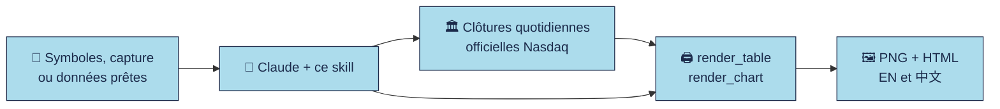

<div align="center">


**Tableaux et graphiques de cours façon étude, pour votre agent IA.**

[English](README.md) · [繁體中文](README.zh-Hant.md) · [日本語](README.ja.md) · **Français**

<p><a href="LICENSE"></a> <a href="https://github.com/imoneys10k/schwab-table/actions/workflows/install-test.yml"></a> <a href="https://github.com/imoneys10k/schwab-table/releases"></a> <a href="https://github.com/imoneys10k/schwab-table/stargazers"></a> <a href="https://github.com/imoneys10k/schwab-table/actions/workflows/tests.yml"></a>   </p>

<p><a href="#-installation"><b>🚀 Installation</b></a> · <a href="#-galerie"><b>🎨 Galerie</b></a> · <a href="https://imoneys10k.github.io/schwab-table/"><b>🌐 Site du projet</b></a> · <a href="SKILL.en.md"><b>📘 Doc du skill</b></a></p>

</div>

Un Claude Skill qui transforme une liste d'actions, une capture d'écran de positions chez un courtier ou des données de performance/classement déjà prêtes en un tableau de performance dans le style des études de Charles Schwab, et qui trace dans le même style l'évolution de plusieurs valeurs sur une période au choix. Tout est produit en chinois et en anglais (PNG + HTML).

## ✨ Points forts

<table>
<tr><td width="50%" valign="top"><h3>🎯 Look d'étude financière</h3><p>Bandeau de titre bleu clair, filets gris fins et notes en petits caractères, comme dans une étude de courtier.</p></td><td width="50%" valign="top"><h3>📊 Tableaux et graphiques</h3><p>Tableaux de classement, de positions et de liste de suivi, plus courbes et petits multiples avec drawdown et échelle logarithmique.</p></td></tr>
<tr><td width="50%" valign="top"><h3>🌏 Bilingue par défaut</h3><p>Chaque sortie existe en chinois et en anglais : PNG en 2x et HTML autonome.</p></td><td width="50%" valign="top"><h3>🔒 Sources explicites</h3><p>Cours officiels et données mondiales Yahoo clairement identifiées. Une donnée manquante est marquée NA, jamais inventée.</p></td></tr>
<tr><td width="50%" valign="top"><h3>🤖 Installation en une phrase</h3><p>Collez un message dans Claude Code ou Codex. Fonctionne sous macOS, Linux et Windows.</p></td><td width="50%" valign="top"><h3>🔤 Mêmes polices partout</h3><p>Inter est fournie et intégrée à chaque fichier HTML : le rendu est identique sur toutes les machines.</p></td></tr>
</table>

## 🎨 Galerie

<table>
<tr><td width="50%" align="center"><br><sub><b>Tableau de classement</b> · EN</sub></td><td width="50%" align="center"><br><sub><b>Tableau de liste de suivi</b> · 中文</sub></td></tr>
<tr><td width="50%" align="center"><br><sub><b>Courbes avec drawdown</b> · EN</sub></td><td width="50%" align="center"><br><sub><b>Petits multiples, échelle log</b> · 中文</sub></td></tr>
</table>

<sub>Les exemples utilisent des sociétés fictives et des données synthétiques, sauf le tableau de classement (graphique public de Charles Schwab).</sub>

## 🔄 Fonctionnement



## 🚀 Installation

Fonctionne sous macOS, Linux et Windows. Python 3.9+ est nécessaire (pour produire les tableaux) ; git est facultatif.

💡 **Le plus simple :** collez le message ci-dessous dans votre agent IA, il installe tout pour vous.

### 🤖 Laissez votre agent IA l'installer

Collez ce message dans Claude Code, Codex ou tout autre agent de programmation :

```text
Installe pour moi le skill de https://github.com/imoneys10k/schwab-table.
Détecte d'abord mon système d'exploitation. Sous macOS ou Linux, exécute :
  curl -fsSL https://raw.githubusercontent.com/imoneys10k/schwab-table/main/install.sh | sh
Sous Windows, dans PowerShell, exécute :
  irm https://raw.githubusercontent.com/imoneys10k/schwab-table/main/install.ps1 | iex
Si j'utilise un autre agent que Claude, installe-le plutôt dans le dossier skills de cet agent
(macOS/Linux : ajoute `--dir <chemin>` après `sh -s --` ; Windows : enregistre install.ps1 et lance-le avec -Dir <chemin>).
Une fois terminé, vérifie que « Render OK » s'est affiché, puis dis-moi de redémarrer pour que le skill soit chargé.
```

### 💻 Ou lancez-le vous-même

macOS / Linux :

```bash
curl -fsSL https://raw.githubusercontent.com/imoneys10k/schwab-table/main/install.sh | sh
```

Windows (PowerShell) :

```powershell
irm https://raw.githubusercontent.com/imoneys10k/schwab-table/main/install.ps1 | iex
```

L'installateur place le skill dans `~/.claude/skills/schwab-performance-table` (`%USERPROFILE%\.claude\skills\...` sous Windows), crée un environnement virtuel Python dédié à l'intérieur, installe Playwright et Chromium (environ 100 Mo), puis génère le tableau d'exemple comme test de bon fonctionnement. Il affiche `Render OK` quand tout fonctionne. Redémarrez ensuite Claude pour que le skill soit pris en compte. Pour lire le script avant de l'exécuter, ouvrez [install.sh](install.sh) ou [install.ps1](install.ps1).

| Option (macOS / Linux) | Option (Windows) | Effet |
|---|---|---|
| `--dir PATH` | `-Dir PATH` | Installer ailleurs (par exemple dans le dossier skills d'un autre agent). La variable `CLAUDE_SKILLS_DIR` change la racine par défaut |
| `--ref TAG` | `-Ref TAG` | Installer un tag ou une branche au lieu de `main`, par exemple `v0.4.0`, pour figer une version |
| `--skip-deps` | `-SkipDeps` | Ignorer Python / Playwright / Chromium (récupérer seulement les fichiers) |
| `--uninstall` | `-Uninstall` | Supprimer le dossier du skill installé |

Avec un tube (pipe), passez les options après `sh -s --`, par exemple `curl -fsSL .../install.sh | sh -s -- --dir ~/my-skills/schwab`. Sous Windows, enregistrez `install.ps1` puis lancez `.\install.ps1 -Dir C:\path`.

**Mise à jour :** relancez la même commande. **Désinstallation :** lancez-le avec `--uninstall` (`-Uninstall` sous Windows).

**Dépannage :** sous Debian/Ubuntu, installez d'abord `python3-venv` ; sous Linux, si Chromium ne démarre pas, exécutez `sudo <dossier d'installation>/.venv/bin/python -m playwright install-deps chromium`.

## 💬 Utilisation avec Claude

Une fois installé, il suffit de demander en langage naturel, par exemple :

- Fais-moi un tableau de performance pour NVDA, AMD et MU.
- Transforme cette capture d'écran de positions en tableau de style Schwab. (joindre la capture)
- Fais un tableau de classement Neural9 2026 à partir de ces données.
- Trace le cours de NVDA, MU et AAPL depuis le début de l'année.
- Compare ces six actions de mars à juin en échelle logarithmique.

## 🧩 Trois modes

| Mode | Entrée | Colonnes 2 à 5 | Exemple |
|---|---|---|---|
| A. Tableau de classement | Le rendement depuis le début de l'année (YTD) de chaque action et son rang dans le S&P 500 / NASDAQ | YTD, rang de performance S&P 500, rang de contribution S&P 500, rang de performance NASDAQ | [EN](examples/neural9_en.png) · [中文](examples/neural9_zh.png) |
| B. Tableau de positions | Une capture d'écran ou un export de positions chez un courtier | Gain/perte latent en %, gain/perte du jour, coût moyen, nombre de titres | [EN](examples/holdings_en.png) · [中文](examples/holdings_zh.png) |
| C. Tableau de liste de suivi | Uniquement des symboles boursiers | YTD, 1 mois, 1 an, dernier cours de clôture | [EN](examples/watchlist_en.png) · [中文](examples/watchlist_zh.png) |

Le mode A utilise les données d'un graphique public de Charles Schwab. Les exemples des modes B et C reposent sur des sociétés fictives et des chiffres inventés, à titre d'illustration uniquement.

## 📊 Graphiques de cours

Jusqu'à 9 valeurs sur une période au choix (par défaut : depuis le début de l'année), dans le même style d'étude, avec un panneau de drawdown et un tableau de synthèse. Versions chinoise et anglaise, PNG + HTML. Les exemples utilisent des sociétés fictives et des données synthétiques.

| Disposition | Contenu | Pour |
|---|---|---|
| `lines` | Courbes, panneau de drawdown, tableau de synthèse | 2 à 5 valeurs |
| `multiples` | Un petit graphique par valeur à échelle commune, avec une bande de drawdown dessous | 6 à 9 valeurs |

`layout: auto` choisit selon le nombre de valeurs.

- **Données :** Nasdaq pour les États-Unis ; sites officiels des bourses de Shanghai/Shenzhen (cours non ajustés) ; Yahoo Finance pour les autres marchés (données agrégées). Devise et dernière séance sont indiquées. `--benchmark none` désactive la référence.
- **Axe :** un seul axe vertical, indexé à 100 au départ. Il passe automatiquement en échelle logarithmique quand l'écart est grand (ou fixez `y_scale` vous-même).
- **Vos propres données :** `csv_to_prices.py` convertit des fichiers CSV (exports de courtier, cours de Hong Kong ou des actions A, cours ajustés pour le rendement total) dans le même format.
- **Options :** `--theme dark` (thème sombre), `--pdf` (PDF vectoriel), plusieurs références (`--benchmark SPY,COMP`), couleurs de courbes personnalisées et infobulles au survol dans les fichiers HTML.

```bash
python3 fetch_prices.py NVDA MU AAPL --start 2026-01-01 -o data/watch.json
python3 fetch_prices.py 7203.T 0700.HK SAP.DE 600519.SS 000001.SZ --start 2026-08-01 --benchmark none -o data/global.json
python3 render_chart.py examples/chart_lines_spec.json out/chart   # copy and edit the spec for your own data
```

## 🔍 Sources de données

Sources officielles pour les États-Unis et Shanghai/Shenzhen ; Yahoo Finance est autorisé pour les cours quotidiens mondiaux et identifié comme agrégateur. Les cours des actions A ne sont pas ajustés et l'historique de Shenzhen est limité. Voir [SKILL.md](SKILL.md) et [SKILL.en.md](SKILL.en.md).

<details>
<summary><b>📁 Fichiers</b></summary>

- `SKILL.md` : la définition du skill chargée par Claude (structure, paramètres visuels, règles sur les sources de données, liste de contrôle), en chinois
- `SKILL.en.md` : traduction anglaise de `SKILL.md`, pour les lecteurs humains
- `install.sh` / `install.ps1` : installateurs en une commande (macOS / Linux et Windows)
- `render_table.py` : le moteur de rendu des tableaux. Il lit une spécification JSON et produit des fichiers HTML en chinois et en anglais ainsi que des PNG en 2x
- `fetch_prices.py` : télécharge les cours de clôture quotidiens depuis l'API officielle de Nasdaq (bibliothèque standard uniquement)
- `csv_to_prices.py` : convertit vos fichiers CSV de cours dans le format lu par `render_chart.py`
- `render_common.py` : thèmes de couleurs et rendu PNG / PDF partagés
- `tests/` : tests unitaires des calculs et des analyseurs (`python3 -m unittest discover -s tests`)
- `evals/` : demandes de test réalistes, jeu de tests de déclenchement et résultats de la première évaluation
- `render_chart.py` : le moteur de rendu des graphiques. Il lit les prix téléchargés et une spécification JSON
- `fonts.py`, `fonts/` : la police Inter fournie (SIL OFL), intégrée à chaque fichier HTML
- `requirements.txt` : dépendance Python (Playwright)
- `examples/` : une spécification et son rendu pour chacun des trois modes de tableau et les deux dispositions de graphique (`sample_prices.json` est synthétique)
- `assets/` : image d'aperçu social

</details>

<details>
<summary><b>🔧 Rendu manuel</b></summary>

Si vous avez utilisé l'installateur, `render_table.py` bascule automatiquement sur son environnement virtuel : `python3 render_table.py ...` suffit. Sinon, Python 3.9 ou supérieur est requis :

```bash
pip install -r requirements.txt && playwright install chromium
python3 render_table.py examples/neural9_spec.json out/neural9
```

Options (les deux moteurs) : `--langs en` ne rend que les langues indiquées (séparées par des virgules) ; `--no-png` n'écrit que le HTML et ne nécessite pas Playwright ; `--scale 3` augmente la résolution des PNG (2 par défaut, soit 1520 px de large). Les dossiers de sortie manquants sont créés automatiquement.

Les graphiques se font en deux étapes : télécharger les prix, puis les rendre. Indiquez la période avec `--start` / `--end` ; par défaut, c'est le début de l'année. `--benchmark COMP` remplace SPY par le Nasdaq Composite.

```bash
python3 fetch_prices.py NVDA MU AAPL --start 2026-01-01 -o data/watch.json
python3 fetch_prices.py 7203.T 0700.HK SAP.DE 600519.SS 000001.SZ --start 2026-08-01 --benchmark none -o data/global.json
python3 render_chart.py examples/chart_lines_spec.json out/chart   # copiez et modifiez la spécification pour vos données
python3 render_chart.py examples/chart_lines_spec.json out/chart --theme dark --pdf   # thème sombre et PDF vectoriel
python3 csv_to_prices.py 0700.HK=tencent.csv --benchmark HSI=hsi.csv -o data/hk.json   # vos propres fichiers CSV
```

`fetch_prices.py` met les réponses en cache 12 heures (`--refresh` l'ignore) et, en cas d'échec réseau, reprend le dernier cache avec un avertissement. `index:COMP` / `etf:SPY` forcent la classe d'actif quand un code est ambigu. Les deux moteurs acceptent aussi `--theme dark` et `--pdf`.

Polices : Inter, Source Sans 3 et Droid Sans sont embarquées pour le texte latin. Les substitutions et les polices système pour le chinois traditionnel sont documentées dans [le guide](references/institutional-tables.md). Sur Linux minimal, installez `fonts-noto-cjk`. Les polices propriétaires extraites des PDF ou de macOS ne sont pas distribuées.

</details>

## 📌 Avertissement

Ce projet ne produit que la mise en forme de tableaux et ne fournit aucun conseil en investissement. Les données des exemples sont données à titre d'illustration uniquement.

## 📄 Licence

[MIT](LICENSE)

<div align="center"><sub>⭐ Si cela vous fait gagner du temps, une étoile aide d'autres personnes à le trouver.</sub></div>


## Modèles de rapports

Quatre modèles : Schwab (par défaut), Morgan, Blackstone et IBKR. La sortie chinoise utilise les caractères traditionnels.

## Institutional report templates

Four report styles are available: Schwab (default), Morgan-style return/risk matrix,
Blackstone-style grouped performance and IBKR-style holdings/exposure. All Chinese
output now uses **Traditional Chinese**, including charts; existing `zh` specs
and `_zh` filenames still work.

| Style | Example | Purpose |
| --- | --- | --- |
| `schwab` | [Watchlist](examples/watchlist_zh.png) | Existing ranking, watchlist and P/L tables |
| `morgan` | [Matrix](examples/morgan_zh.png) | Two periods × return, volatility and drawdown |
| `blackstone` | [Grouped returns](examples/blackstone_zh.png) | Industry/strategy groups, two return periods |
| `ibkr` | [Holdings](examples/ibkr_zh.png) | Brokerage fields, market values, weights and supplied exposure |

```bash
python3 render_table.py examples/morgan_spec.json out/matrix
python3 render_table.py examples/blackstone_spec.json out/grouped
python3 render_table.py examples/ibkr_spec.json out/holdings
# Prepare a matrix from the existing free daily-price data:
python3 prices_to_table.py data/prices.json data/matrix.json --style morgan
python3 render_table.py data/matrix.json out/matrix
```

Templates have explicit column schemas; passing a five-column watchlist to a
seven/nine-column report does not invent missing facts. See
[template schemas, source samples and font substitutions](references/institutional-tables.md).
New templates are calibrated for white paper; Schwab tables and charts retain
light/dark modes. Examples use fictional companies and synthetic values.
