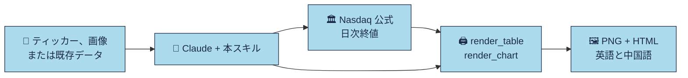

<div align="center">


**AI エージェントのための、リサーチレポート風の表と推移チャート。**

[English](README.md) · [简体中文](README.zh-CN.md) · **日本語** · [Français](README.fr.md)

<p><a href="LICENSE"></a> <a href="https://github.com/imoneys10k/schwab-table/actions/workflows/install-test.yml"></a> <a href="https://github.com/imoneys10k/schwab-table/releases"></a> <a href="https://github.com/imoneys10k/schwab-table/stargazers"></a> <a href="https://github.com/imoneys10k/schwab-table/actions/workflows/tests.yml"></a>   </p>

<p><a href="#-インストール"><b>🚀 インストール</b></a> · <a href="#-ギャラリー"><b>🎨 ギャラリー</b></a> · <a href="https://imoneys10k.github.io/schwab-table/"><b>🌐 プロジェクトサイト</b></a> · <a href="SKILL.en.md"><b>📘 Skill ドキュメント</b></a></p>

</div>

銘柄リスト、証券口座の保有銘柄スクリーンショット、または既存の騰落率・順位データを、Charles Schwab のリサーチレポート風のパフォーマンス表に変換する Claude Skill です。同じスタイルで、複数銘柄の任意期間の推移チャートも作れます。すべて中国語版と英語版の両方を出力します（PNG + HTML）。

## ✨ 特長

<table>
<tr><td width="50%" valign="top"><h3>🎯 リサーチ風の見た目</h3><p>水色のタイトル帯、細いグレーの罫線、小さな注記。証券会社のレポートそのままの雰囲気です。</p></td><td width="50%" valign="top"><h3>📊 表とチャート</h3><p>ランキング表・保有銘柄表・ウォッチリスト表に加え、ドローダウンと対数目盛つきの折れ線とスモールマルチプル。</p></td></tr>
<tr><td width="50%" valign="top"><h3>🌏 標準で二言語</h3><p>出力は常に中国語版と英語版。2x PNG と単体で完結する HTML です。</p></td><td width="50%" valign="top"><h3>🔒 信頼できるデータだけ</h3><p>取引所の公式終値のみ。集約サイトの数字は使わず、欠けたデータは NA とし、作り話はしません。</p></td></tr>
<tr><td width="50%" valign="top"><h3>🤖 ワンフレーズで導入</h3><p>プロンプトを Claude Code や Codex に貼るだけ。macOS・Linux・Windows に対応。</p></td><td width="50%" valign="top"><h3>🔤 どこでも同じフォント</h3><p>Inter を同梱して HTML に埋め込むので、どのマシンでも同じ見た目になります。</p></td></tr>
</table>

## 🎨 ギャラリー

<table>
<tr><td width="50%" align="center"><br><sub><b>ランキング表</b> · EN</sub></td><td width="50%" align="center"><br><sub><b>ウォッチリスト表</b> · 中文</sub></td></tr>
<tr><td width="50%" align="center"><br><sub><b>ドローダウン付き折れ線</b> · EN</sub></td><td width="50%" align="center"><br><sub><b>スモールマルチプル（対数目盛）</b> · 中文</sub></td></tr>
</table>

<sub>ランキング表（Charles Schwab の公開チャート）を除き、サンプルは架空の企業と合成データです。</sub>

## 🔄 仕組み



## 🚀 インストール

macOS、Linux、Windows に対応しています。Python 3.9 以上（表のレンダリング用）が必要です。git は任意です。

💡 **いちばん簡単な方法：** 下のプロンプトを AI エージェントに貼れば、すべてインストールしてくれます。

### 🤖 AI エージェントにインストールしてもらう

次の文章を Claude Code、Codex などのコーディングエージェントにそのまま送ってください。

```text
https://github.com/imoneys10k/schwab-table のスキルをインストールしてください。
まず私の OS を判別してください。macOS または Linux では次を実行します。
  curl -fsSL https://raw.githubusercontent.com/imoneys10k/schwab-table/main/install.sh | sh
Windows では PowerShell で次を実行します。
  irm https://raw.githubusercontent.com/imoneys10k/schwab-table/main/install.ps1 | iex
Claude 以外のエージェントを使っている場合は、そのエージェントの skills フォルダにインストールしてください
（macOS/Linux は `sh -s --` の後ろに `--dir <パス>` を付けます。Windows は install.ps1 を保存して -Dir <パス> 付きで実行します）。
完了したら "Render OK" と表示されたことを確認し、スキルを読み込むために再起動するよう伝えてください。
```

### 💻 自分で実行する

macOS / Linux：

```bash
curl -fsSL https://raw.githubusercontent.com/imoneys10k/schwab-table/main/install.sh | sh
```

Windows（PowerShell）：

```powershell
irm https://raw.githubusercontent.com/imoneys10k/schwab-table/main/install.ps1 | iex
```

インストーラーはスキルを `~/.claude/skills/schwab-performance-table`（Windows では `%USERPROFILE%\.claude\skills\...`）に配置し、その中に専用の Python 仮想環境を作成して Playwright と Chromium（約 100 MB）をインストールし、サンプルの表をレンダリングして動作確認します。すべて正常なら `Render OK` と表示されます。完了後に Claude を再起動すると、スキルが読み込まれます。実行前に内容を確認したい場合は [install.sh](install.sh) または [install.ps1](install.ps1) を開いてください。

| オプション（macOS / Linux） | オプション（Windows） | 内容 |
|---|---|---|
| `--dir PATH` | `-Dir PATH` | 別の場所にインストール（他のエージェントの skills フォルダなど）。環境変数 `CLAUDE_SKILLS_DIR` で既定のルートを変更できます |
| `--ref TAG` | `-Ref TAG` | `main` の代わりにタグまたはブランチをインストール（例：`v0.4.0`）。バージョン固定に使います |
| `--skip-deps` | `-SkipDeps` | Python / Playwright / Chromium をスキップ（ファイルの取得のみ） |
| `--uninstall` | `-Uninstall` | インストール済みのスキルフォルダを削除 |

パイプで実行する場合、オプションは `sh -s --` の後ろに付けます。例：`curl -fsSL .../install.sh | sh -s -- --dir ~/my-skills/schwab`。Windows では `install.ps1` を保存してから `.\install.ps1 -Dir C:\path` を実行してください。

**更新：** 同じコマンドをもう一度実行します。**アンインストール：** `--uninstall` を付けて実行します（Windows は `-Uninstall`）。

**トラブルシューティング：** Debian/Ubuntu では先に `python3-venv` をインストールしてください。Linux で Chromium が起動しない場合は `sudo <インストール先>/.venv/bin/python -m playwright install-deps chromium` を実行してください。

## 💬 Claude での使い方

インストール後は、普通の言葉で頼むだけです。例：

- NVDA、AMD、MU のパフォーマンス表を作って。
- この保有銘柄のスクリーンショットを Schwab 風の表にして。（スクリーンショットを添付）
- このデータで 2026 年 Neural9 のランキング表を作って。
- NVDA、MU、AAPL の今年の推移チャートを作って。
- この 6 銘柄の 3 月から 6 月の推移を対数目盛で比較して。

## 🧩 3 つのモード

| モード | 入力 | 2〜5 列目 | サンプル |
|---|---|---|---|
| A ランキング表 | 各銘柄の YTD と、S&P 500 / NASDAQ 内での順位 | YTD、S&P 500 騰落率順位、S&P 500 寄与度順位、NASDAQ 騰落率順位 | [EN](examples/neural9_en.png) · [中文](examples/neural9_zh.png) |
| B 保有銘柄表 | 証券口座の保有銘柄スクリーンショットまたはエクスポート | 建玉損益 %、当日損益、平均取得単価、保有株数 | [EN](examples/holdings_en.png) · [中文](examples/holdings_zh.png) |
| C ウォッチリスト表 | ティッカーのみ | 年初来、直近 1 か月、直近 1 年、最新終値 | [EN](examples/watchlist_en.png) · [中文](examples/watchlist_zh.png) |

モード A は Charles Schwab が公開しているチャートのデータを使用しています。モード B・C のサンプルは架空の企業と作り物の数字で、例示のみを目的としています。

## 📊 推移チャート

最大 9 銘柄を任意の期間（既定は年初来）でチャート化します。スタイルは同じリサーチレポート風で、ドローダウンのパネルとサマリー表付き。中国語版と英語版（PNG + HTML）を出力します。サンプルは架空の企業と合成データです。

| レイアウト | 内容 | 向いているケース |
|---|---|---|
| `lines` | 折れ線チャート、ドローダウンパネル、サマリー表 | 2〜5 銘柄 |
| `multiples` | 銘柄ごとの小さなチャート（共通スケール）と、その下のドローダウン帯 | 6〜9 銘柄 |

`layout: auto` は銘柄数に応じて自動で選びます。

- **データ：** Nasdaq の公式ヒストリカル API。取引所の公式日次終値で、株式分割調整済み、価格リターン、約 10 年分。ベンチマークは既定で SPY で、S&P 500 の代用であることを明記します。他のデータソースは使いません。
- **軸：** Y 軸は 1 本だけで、開始時点を 100 に指数化します。値幅が大きいときは自動で対数目盛に切り替わります（`y_scale` で手動指定も可能）。
- **自分のデータ：** `csv_to_prices.py` が CSV ファイル（証券会社のエクスポート、香港株や A 株の価格、総リターン用の調整後終値）を同じ形式に変換します。
- **オプション：** `--theme dark`（ダークテーマ）、`--pdf`（ベクター PDF）、複数のベンチマーク（`--benchmark SPY,COMP`）、線の色の指定、HTML でのマウスオーバー表示。

```bash
python3 fetch_prices.py NVDA MU AAPL --start 2026-01-01 -o data/watch.json
python3 render_chart.py examples/chart_lines_spec.json out/chart   # copy and edit the spec for your own data
```

## 🔍 データソース

信頼できるデータのみを使用します。取引所の公式終値、指数提供会社（S&P Dow Jones Indices、Nasdaq Global Indexes。FRED 経由も可）、企業の IR / SEC 提出書類、またはユーザー自身の証券口座データです。リターンは公式終値から計算し、集約サイトの既製の騰落率は使いません。ルールの詳細は [SKILL.md](SKILL.md)（中国語）を参照してください。英語訳は [SKILL.en.md](SKILL.en.md) です。

<details>
<summary><b>📁 ファイル</b></summary>

- `SKILL.md`：Claude が実際に読み込む Skill の説明（構成、ビジュアル仕様、データソース規定、チェックリスト）。中国語
- `SKILL.en.md`：`SKILL.md` の英語訳（人が読む用）
- `install.sh` / `install.ps1`：ワンクリックインストーラー（macOS / Linux と Windows）
- `render_table.py`：表のレンダラー。JSON spec を読み込み、中国語・英語の HTML と 2x PNG を出力します
- `fetch_prices.py`：Nasdaq の公式 API から日次終値をダウンロードします（標準ライブラリのみ）
- `csv_to_prices.py`：自分の CSV 価格ファイルを `render_chart.py` が読める形式に変換します
- `render_common.py`：共通のカラーテーマと PNG / PDF の出力
- `tests/`：計算とパーサーの単体テスト（`python3 -m unittest discover -s tests`）
- `evals/`：実際の使い方に近いテスト依頼、トリガーテスト用のセット、最初の評価結果
- `render_chart.py`：チャートのレンダラー。取得した価格と JSON spec を読み込みます
- `fonts.py`、`fonts/`：同梱の Inter フォント（SIL OFL）。すべての HTML に埋め込まれます
- `requirements.txt`：Python の依存パッケージ（Playwright）
- `examples/`：3 つの表モードと 2 つのチャートレイアウトそれぞれの spec と出力結果（`sample_prices.json` は合成データ）
- `assets/`：ソーシャルプレビュー画像

</details>

<details>
<summary><b>🔧 手動レンダリング</b></summary>

インストーラーを使った場合、`render_table.py` は自動でその仮想環境に切り替わるので、そのまま `python3 render_table.py ...` で動きます。そうでない場合は Python 3.9 以上が必要です。

```bash
pip install -r requirements.txt && playwright install chromium
python3 render_table.py examples/neural9_spec.json out/neural9
```

オプション（両方のレンダラー共通）：`--langs en` は指定した言語のみレンダリングします（カンマ区切り）。`--no-png` は HTML のみを書き出し、Playwright は不要です。`--scale 3` で PNG の解像度を上げます（既定は 2、幅 1520 px）。出力先フォルダがなければ自動で作成されます。

チャートは 2 ステップです。価格を取得してから描画します。期間は `--start` / `--end` で指定し、既定は年初来です。`--benchmark COMP` でベンチマークを SPY から Nasdaq 総合指数に変えられます。

```bash
python3 fetch_prices.py NVDA MU AAPL --start 2026-01-01 -o data/watch.json
python3 render_chart.py examples/chart_lines_spec.json out/chart   # spec をコピーして自分のデータ用に編集
python3 render_chart.py examples/chart_lines_spec.json out/chart --theme dark --pdf   # ダークテーマとベクター PDF
python3 csv_to_prices.py 0700.HK=tencent.csv --benchmark HSI=hsi.csv -o data/hk.json   # 自分の CSV ファイル
```

`fetch_prices.py` は応答を 12 時間キャッシュします（`--refresh` で無視）。ネットワークに失敗した場合は、警告つきで直前のキャッシュを使います。コードが曖昧なときは `index:COMP`、`etf:SPY` で資産クラスを指定できます。両方のレンダラーが `--theme dark` と `--pdf` に対応しています。

フォント：Inter（リポジトリの `fonts/` に同梱、SIL Open Font License）が英数字用にすべての HTML に埋め込まれるため、どのマシンでも同じ見た目になります。中国語はシステムの中国語フォント（macOS は PingFang SC、Windows は Microsoft YaHei）を使います。最小構成の Linux サーバーでは、例えば `sudo apt install fonts-noto-cjk` で入れてください。ないと中国語版が四角で表示されます。

</details>

## 📌 免責事項

このプロジェクトは表のスタイルを生成するだけで、投資助言は行いません。表中のデータは例示のみを目的としています。

## 📄 ライセンス

[MIT](LICENSE)

<div align="center"><sub>⭐ 役に立ったら、スターをもらえると他の人にも見つけてもらえます。</sub></div>
