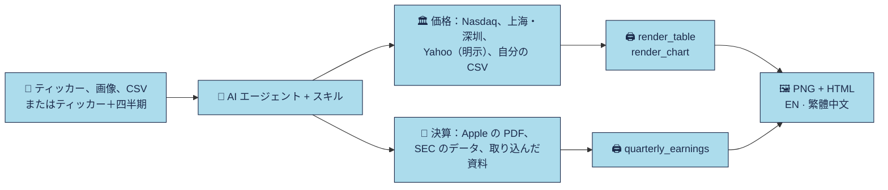

<div align="center">


**AI エージェントのための、リサーチ風の表・推移チャート・四半期決算レビュー。**

[English](README.md) · [繁體中文](README.zh-Hant.md) · **日本語** · [Français](README.fr.md)

<p><a href="LICENSE"></a> <a href="https://github.com/imoneys10k/schwab-table/actions/workflows/install-test.yml"></a> <a href="https://github.com/imoneys10k/schwab-table/actions/workflows/tests.yml"></a> <a href="https://github.com/imoneys10k/schwab-table/releases"></a> <a href="https://github.com/imoneys10k/schwab-table/stargazers"></a>   </p>

<p><a href="#-インストール"><b>🚀 インストール</b></a> · <a href="#-ギャラリー"><b>🎨 ギャラリー</b></a> · <a href="https://imoneys10k.github.io/schwab-table/"><b>🌐 プロジェクトサイト</b></a> · <a href="https://imoneys10k.github.io/schwab-table/earnings/"><b>🧾 決算デモ</b></a> · <a href="SKILL.en.md"><b>📘 Skill ドキュメント</b></a></p>

</div>

1 つのリポジトリにエージェント用スキルが 2 つあります。Claude Code 向けに作られていますが、Codex など他のコーディングエージェントでも使えます。**schwab-performance-table** は、銘柄リスト、証券口座の保有銘柄スクリーンショット、価格データ、自分の CSV を、リサーチ風の表（Schwab・Morgan・Blackstone・IBKR レイアウト）に、またドローダウンと対数目盛つきの推移チャートに変換します。**quarterly-earnings-review** は企業の四半期決算の原本を確認し、出典付きの解説を添えた HSBC 風の決算表を作ります。出力はすべて英語と繁体字中国語の 2 版で、PNG と単体で完結する HTML です。

## ✨ 特長

<table>
<tr><td width="50%" valign="top"><h3>🎯 4 つのレポートレイアウト</h3><p>Schwab、Morgan、Blackstone、IBKR 風。列の構成は明示されています。独立したテンプレートで、各機関が発行したレポートではありません。</p></td><td width="50%" valign="top"><h3>📊 表・チャート・決算</h3><p>ランキング表・保有銘柄表・ウォッチリスト表、ドローダウンと対数目盛つきの折れ線とスモールマルチプル、HSBC 風の四半期決算。</p></td></tr>
<tr><td width="50%" valign="top"><h3>🌏 英語と繁体字中国語</h3><p>出力は常に 2 言語。2x PNG と単体で完結する HTML に加え、ダークテーマと PDF も選べます。</p></td><td width="50%" valign="top"><h3>🔒 出典を必ず明示</h3><p>Nasdaq と上海・深圳取引所の終値、出典を明示した Yahoo のデータ（その他の市場）、決算は SEC と Apple の公式資料。欠損は NA で、作り話はしません。</p></td></tr>
<tr><td width="50%" valign="top"><h3>🤖 ワンフレーズで導入</h3><p>プロンプトを Claude Code や Codex に貼るだけ。macOS・Linux・Windows に対応し、2 つのスキルを一緒に入れます。</p></td><td width="50%" valign="top"><h3>🧪 テスト済み</h3><p>正解つきの単体テスト、3 つの OS での CI、実データのスモークテスト、最初のエージェント評価。</p></td></tr>
</table>

## 🎨 ギャラリー

<table>
<tr><td width="50%" align="center"><br><sub><b>ランキング表</b> · EN</sub></td><td width="50%" align="center"><br><sub><b>ウォッチリスト表</b> · 繁體中文</sub></td></tr>
<tr><td width="50%" align="center"><br><sub><b>ドローダウン付き折れ線</b> · EN</sub></td><td width="50%" align="center"><br><sub><b>スモールマルチプル（対数目盛）</b> · 繁體中文</sub></td></tr>
<tr><td width="50%" align="center"><br><sub><b>Morgan 風マトリクス</b> · 繁體中文</sub></td><td width="50%" align="center"><br><sub><b>Blackstone 風の成績表</b> · 繁體中文</sub></td></tr>
<tr><td width="50%" align="center"><br><sub><b>IBKR 風の保有明細</b> · 繁體中文</sub></td><td width="50%" align="center"><br><sub><b>HSBC 風の四半期決算：AAPL 第 3 四半期</b> · 繁體中文</sub></td></tr>
<tr><td width="50%" align="center"><br><sub><b>HSBC 風の四半期決算：AAPL 第 4 四半期</b> · 繁體中文</sub></td><td width="50%" align="center"><br><sub><b>保有銘柄表</b> · EN</sub></td></tr>
</table>

<sub>決算の例は Apple の公式資料、ランキング表は Charles Schwab の公開チャートを使用しています。それ以外は架空の企業と合成データです。</sub>

## 🔄 仕組み



## 🚀 インストール

macOS、Linux、Windows に対応しています。Python 3.9 以上（描画用）が必要で、git は任意です。インストーラーは 2 つのスキルをまとめて登録します。

💡 **いちばん簡単な方法：** 下のプロンプトを AI エージェントに貼れば、すべてインストールしてくれます。

### 🤖 AI エージェントにインストールしてもらう

次の文章を Claude Code、Codex などのコーディングエージェントにそのまま送ってください。

```text
https://github.com/imoneys10k/schwab-table のスキルをインストールしてください。
まず私の OS を判別してください。macOS または Linux では次を実行します。
  curl -fsSL https://raw.githubusercontent.com/imoneys10k/schwab-table/main/install.sh | sh
Windows では PowerShell で次を実行します。
  irm https://raw.githubusercontent.com/imoneys10k/schwab-table/main/install.ps1 | iex
Claude 以外のエージェントを使っている場合は、そのエージェントの skills フォルダにインストールしてください
（macOS/Linux は `sh -s --` の後ろに `--dir <パス>` を付けます。Windows は install.ps1 を保存して -Dir <パス> 付きで実行します）。
完了したら "Render OK" と表示されたことを確認し、スキルを読み込むために再起動するよう伝えてください。
```

### 💻 自分で実行する

macOS / Linux:

```bash
curl -fsSL https://raw.githubusercontent.com/imoneys10k/schwab-table/main/install.sh | sh
```

Windows (PowerShell):

```powershell
irm https://raw.githubusercontent.com/imoneys10k/schwab-table/main/install.ps1 | iex
```

インストーラーはメインのスキルを `~/.claude/skills/schwab-performance-table`（Windows では `%USERPROFILE%\.claude\skills\...`）に置き、その中に専用の Python 仮想環境を作って依存パッケージと Chromium（約 100 MB）を入れ、隣に `quarterly-earnings-review` を登録し、すべての表スタイル・チャート 1 枚・決算表 1 枚をレンダリングして動作確認します。すべて正常なら `Render OK` と表示されます。完了後にエージェント（Claude、Codex など）を再起動すると、スキルが読み込まれます。実行前に内容を確認したい場合は [install.sh](install.sh) または [install.ps1](install.ps1) を開いてください。

| オプション（macOS / Linux） | オプション（Windows） | 内容 |
|---|---|---|
| `--dir PATH` | `-Dir PATH` | 別の場所にインストール（他のエージェントの skills フォルダなど）。環境変数 `CLAUDE_SKILLS_DIR` で既定のルートを変更できます。 |
| `--ref TAG` | `-Ref TAG` | `main` の代わりにタグまたはブランチをインストール（例：`v0.6.1`）。バージョン固定に使います。付けずにもう一度実行すると `main` に戻ります。 |
| `--skip-deps` | `-SkipDeps` | Python・Playwright・Chromium をスキップ（ファイルの取得と登録のみ）。 |
| `--uninstall` | `-Uninstall` | インストール済みのスキルフォルダと、それが登録した決算スキルを削除します。 |

パイプで実行する場合、オプションは `sh -s --` の後ろに付けます。例：`curl -fsSL .../install.sh | sh -s -- --dir ~/my-skills/schwab`。Windows では `install.ps1` を保存してから `.\install.ps1 -Dir C:\path` を実行してください。

**更新：** 同じコマンドをもう一度実行します。**アンインストール：** `--uninstall` を付けて実行します（Windows は `-Uninstall`）。

**トラブルシューティング：** Debian/Ubuntu では先に `python3-venv` をインストールしてください。Linux で Chromium が起動しない場合は `sudo <インストール先>/.venv/bin/python -m playwright install-deps chromium` を実行してください。最小構成の Linux サーバーでは CJK フォント（`sudo apt install fonts-noto-cjk`）も入れてください。ないと中国語が四角で表示されます。

## 💬 エージェントでの使い方

インストール後は、普通の言葉で頼むだけです。例：

- NVDA、AMD、MU のパフォーマンス表を作って。
- この保有銘柄のスクリーンショットを Schwab 風の表にして。（スクリーンショットを添付）
- NVDA、MU、AAPL の今年の推移を S&P 500 と比べてチャートにして。
- この 6 銘柄の 3 月から 6 月の推移を対数目盛で比較して。
- AAPL、MSFT、NVDA を Morgan 風のリターンとリスクのマトリクスにして。
- 7203.T、0700.HK、600519.SS の年初来の推移をチャートにして。
- AAPL の FY2025Q3 決算を HSBC 風の表でレビューして。

## 🧩 表のスタイル

4 つのレイアウトを `--style`（または `spec.style`。既定は Schwab）で選びます。独立したテンプレートで、記載の機関が発行した、あるいは関係するレポートではありません。

| スタイル | 内容 | サンプル |
|---|---|---|
| Schwab · ランキング | YTD と S&P 500・NASDAQ 内での順位（モード A） | [EN](examples/neural9_en.png) · [繁體中文](examples/neural9_zh.png) |
| Schwab · 保有銘柄 | 建玉損益 %、当日損益、平均取得単価、保有株数。スクリーンショットやエクスポートから（モード B） | [EN](examples/holdings_en.png) · [繁體中文](examples/holdings_zh.png) |
| Schwab · ウォッチリスト | ティッカーだけで：年初来、直近 1 か月、直近 1 年、最新終値（モード C） | [EN](examples/watchlist_en.png) · [繁體中文](examples/watchlist_zh.png) |
| Morgan | 2 期間 × リターン、変動率、ドローダウン | [EN](examples/morgan_en.png) · [繁體中文](examples/morgan_zh.png) |
| Blackstone | 業種・戦略別のグループと 2 期間のリターン | [EN](examples/blackstone_en.png) · [繁體中文](examples/blackstone_zh.png) |
| IBKR | 証券口座の項目、時価、比率、明示されたエクスポージャー | [EN](examples/ibkr_en.png) · [繁體中文](examples/ibkr_zh.png) |

```bash
python3 render_table.py examples/watchlist_spec.json out/watchlist     # Schwab（既定）
python3 render_table.py examples/morgan_spec.json out/matrix           # または --style morgan | blackstone | ibkr
python3 prices_to_table.py data/prices.json data/matrix.json --style morgan   # 取得した価格からマトリクスを作る
python3 render_table.py data/matrix.json out/matrix
```

各テンプレートは列の構成が明示されています。5 列のウォッチリストを 7 列や 9 列のレイアウトに渡しても、足りない項目を作り出すことはありません。Schwab の表とチャートはライト／ダークの両方に対応し、他のテンプレートは白い紙を基準に調整してあります。列構成、出典サンプル、フォント代替は[テンプレートガイド](references/institutional-tables.md)を参照してください。

## 📊 推移チャート

最大 9 銘柄を任意の期間（既定は年初来）でチャート化します。ドローダウンのパネルとサマリー表が付きます。

| レイアウト | 内容 | 向いているケース |
|---|---|---|
| `lines` | 折れ線チャート、ドローダウンパネル、サマリー表 | 2〜5 銘柄 |
| `multiples` | 銘柄ごとの小さなチャート（共通スケール）と、その下のドローダウン帯 | 6〜9 銘柄 |

`layout: auto` は銘柄数に応じて自動で選びます。

| 銘柄 | 出典 | 備考 |
|---|---|---|
| 米国株、ETF、Nasdaq の指数（`NVDA`、`BRK.B`、`SPY`、`COMP`） | Nasdaq 公式終値 | 株式分割調整済みの価格リターン、約 10 年分 |
| 上海・深圳（`600519.SS`、`000001.SZ`） | 取引所のウェブサイト | 調整なしの終値。深圳は履歴が限られます |
| その他の取引所と指数（`7203.T`、`0700.HK`、`SAP.DE`、`^N225`） | Yahoo Finance | 集約データであることを明記。取引所サフィックスを付けてください |
| 自分のファイル | `csv_to_prices.py` | どの市場でも可。調整後終値の CSV なら総リターンのチャートを明示つきで描けます |

- **ベンチマーク：** 既定は SPY（S&P 500 の代用と明記）。最大 2 つまで（`--benchmark SPY,COMP`）、`--benchmark none` で非表示。
- **軸：** Y 軸は 1 本だけで、開始時点を 100 に指数化します。値幅が大きいときは自動で対数目盛に切り替わります（`y_scale` で指定も可能）。
- **オプション：** `--theme dark`、`--pdf`、線の色の指定、HTML でのマウスオーバー表示。

```bash
python3 fetch_prices.py NVDA MU AAPL --start 2026-01-01 -o data/watch.json
python3 fetch_prices.py 7203.T 0700.HK SAP.DE 600519.SS --start 2026-08-01 --benchmark none -o data/global.json
python3 render_chart.py examples/chart_lines_spec.json out/chart
```

## 🧾 四半期決算レビュー

「AAPL の FY2025Q3 決算を HSBC 風の表でレビューして」と頼むだけです。**quarterly-earnings-review** は会計期間と決算の原本を確認し、単四半期・前年同期比・前四半期比の数値を計算して、出典を引用した解説を添えます。出力は英語と繁体字中国語の PNG + HTML に、元データと検証台帳が付きます。

- **出典：** Apple の公式決算 PDF（FY2025Q3・FY2025Q4 は実物で検証済み）。その他の米国 GAAP 企業は SEC Company Facts（パーサーは固定フィクスチャで検証済み、実アクセスは拒否されることがあります）。他の市場は `--facts` で取り込んだ検証済みの公式資料。
- **暦ではなく会計四半期：** 表には実際の期間の開始日と終了日を書きます。年間・累計の数値を四半期の事実として付け替えることはなく、欠損は NA のままです。
- **解説：** すべてのコメントは出典台帳の ID を引用します。コンセンサスの根拠がなければ上回った・下回ったとは言わず、分析文が元の事実を上書きすることもありません。

```bash
python3 quarterly_earnings.py AAPL --period FY2025Q3 -o out/aapl_q3
```

[2 四半期のオンラインデモ](https://imoneys10k.github.io/schwab-table/earnings/) · [使い方と出典の範囲](EARNINGS.md)（繁体字中国語） · [Skill](skills/quarterly-earnings-review/SKILL.md)

## 🔍 データと誠実さのルール

- **出典は必ず注記に印字**します。基準日と取得日も付けます。取得できなかった履歴は明示し、黙って短くはしません。
- **`null` は 0 ではありません。** 欠損は `NA` と表示し、記憶で埋めたり推測したりしません。
- **自動取得は価格リターンのみ。** Nasdaq の配当額は株式分割調整がされておらず、ETF には配当データがないため、総リターンには自分で用意した調整後終値の CSV が必要です。
- **Yahoo は集約データと明記**し、取引所が公表した終値とは扱いません。A 株のウェブサイト価格は調整なしで、コーポレートアクションによる歪みを警告します。
- **香港などの市場は取引所サフィックスが必要**です（`0700.HK`）。数字だけのコードは曖昧なので拒否されます。
- エージェント向けの詳細は [SKILL.md](SKILL.md)（繁体字中国語）と [SKILL.en.md](SKILL.en.md)（英語）にあります。

<details>
<summary><b>📁 ファイル</b></summary>

- `SKILL.md`、`SKILL.en.md`: Claude が読み込むスキル（繁体字中国語）とその英語訳
- `skills/quarterly-earnings-review/`: 決算スキル。インストーラーがメインのスキルの隣に登録します
- `install.sh`、`install.ps1`、`install_earnings_skill.py`: macOS / Linux と Windows 用のワンクリックインストーラーと、決算スキルの登録
- `render_table.py`、`institutional_tables.py`、`prices_to_table.py`: 表のレンダラーと 4 つのスタイル。取得した価格から Morgan / Blackstone の spec を作成
- `fetch_prices.py`、`csv_to_prices.py`: Nasdaq・上海/深圳・Yahoo の日次終値の取得、自分の CSV の変換
- `render_chart.py`、`render_common.py`: チャートのレンダラー。共通のテーマと PNG / PDF の出力
- `quarterly_earnings.py`、`earnings_core.py`、`earnings_sources.py`、`render_earnings.py`: 決算コマンド、検証可能な計算、出典アダプター、HSBC 風レンダラー
- `localization.py`、`fonts.py`、`fonts/`: 繁体字中国語への変換。HTML に埋め込む同梱フォント（ライセンス付き）
- `references/`、`EARNINGS.md`: テンプレートガイド。決算の使い方と出典の範囲（繁体字中国語）
- `examples/`、`docs/`: spec とレンダリング済みの例（`sample_prices.json` は合成データ）。GitHub Pages のサイト
- `tests/`、`evals/`: 単体テスト。実際の使い方に近いエージェント依頼、トリガーテストのセット、結果
- `tools/build_docs.py`: 1 つの内容表からこれらの README とサイトを生成
- `requirements.txt`、`CHANGELOG.md`、`CONTRIBUTING.md`、`assets/`: 依存パッケージ、変更履歴、貢献ルール、バナーとソーシャルカード

</details>

<details>
<summary><b>🔧 手動レンダリング</b></summary>

インストーラーを使った場合、スクリプトは自動で専用の仮想環境に切り替わるので、そのまま `python3 render_table.py ...` で動きます。そうでない場合は Python 3.9 以上が必要です。

```bash
pip install -r requirements.txt && playwright install chromium
python3 render_table.py examples/neural9_spec.json out/neural9
python3 render_table.py examples/morgan_spec.json out/matrix
python3 fetch_prices.py NVDA MU AAPL --start 2026-01-01 -o data/watch.json
python3 render_chart.py examples/chart_lines_spec.json out/chart --theme dark --pdf
python3 csv_to_prices.py 0700.HK=tencent.csv --benchmark HSI=hsi.csv -o data/hk.json
python3 quarterly_earnings.py AAPL --period FY2025Q3 -o out/aapl_q3
```

両方のレンダラー共通のオプション：`--langs en` は指定した言語のみレンダリング（カンマ区切り。`zh` は繁体字中国語で、`_zh` のファイル名は従来どおり）、`--no-png` は HTML のみでブラウザ不要、`--scale 3` で PNG の解像度を上げます（既定は 2、幅 1520 px）、`--theme dark`、`--pdf`。出力先フォルダがなければ自動で作成されます。

`fetch_prices.py` は応答を最大 12 時間キャッシュし（`--refresh` で無視）、最新の終値をすでに含んでいる場合だけキャッシュを再利用します。ネットワークに失敗した場合は、警告つきで直前のキャッシュを使います。コードが曖昧なときは `index:COMP`、`etf:SPY` で資産クラスを指定できます。チャートは価格を取得してから描画する 2 ステップで、期間は `--start` / `--end` で指定します。

フォント：Inter、Source Sans 3、Droid Sans を同梱して英数字用に埋め込みます。中国語はシステムの繁体字フォントを使います。原本とのフォント代替は[テンプレートガイド](references/institutional-tables.md)を参照してください。参照 PDF や macOS の専有フォントは配布しません。

</details>

## 🧪 テストと評価

`python3 -m unittest discover -s tests -v` は、リターン・ドローダウン・変動率・銘柄ルーティング・キャッシュの鮮度・CSV 取り込み・表スタイル・決算計算の正解つきテストを実行します。CI は Ubuntu・macOS・Windows（Python 3.9 と 3.13）でこれらを実行し、例を再生成して変化がないか確認し、Nasdaq への実データのスモークテストを行い、3 つの OS でスキルをインストールします。[evals/](evals/README.md) には実際の使い方に近いエージェント依頼と最初の結果があります。README とサイトは `python3 tools/build_docs.py` で生成され、内容が古いとテストが失敗します。

## 📌 免責事項

このプロジェクトはデータの見せ方を整えるだけで、投資助言は行いません。ギャラリーの注記に別の記載がない限り、例は架空の企業と合成値です。レポートのレイアウトは独立したテンプレートで、記載の機関が発行したレポートではありません。

## 📄 ライセンス

[MIT](LICENSE)

<div align="center"><sub>⭐ 役に立ったら、スターをもらえると他の人にも見つけてもらえます。</sub></div>
