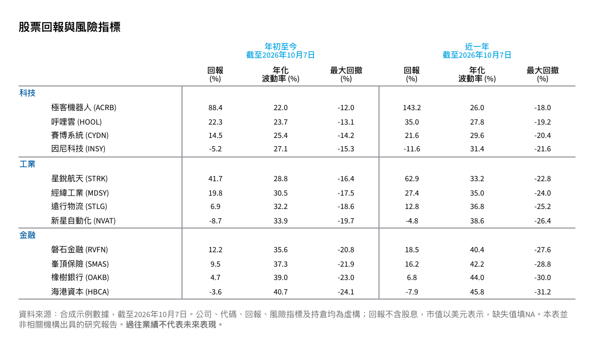
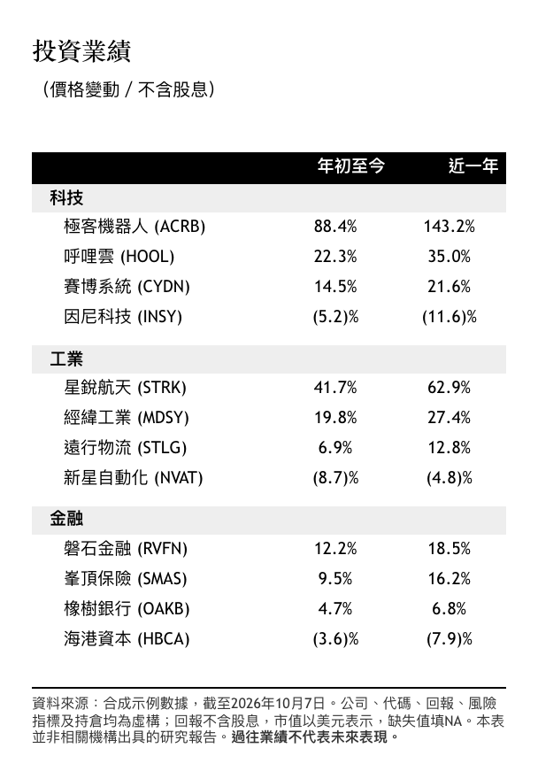
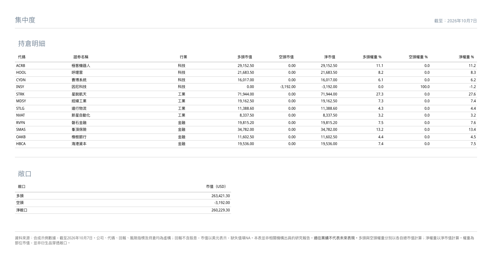
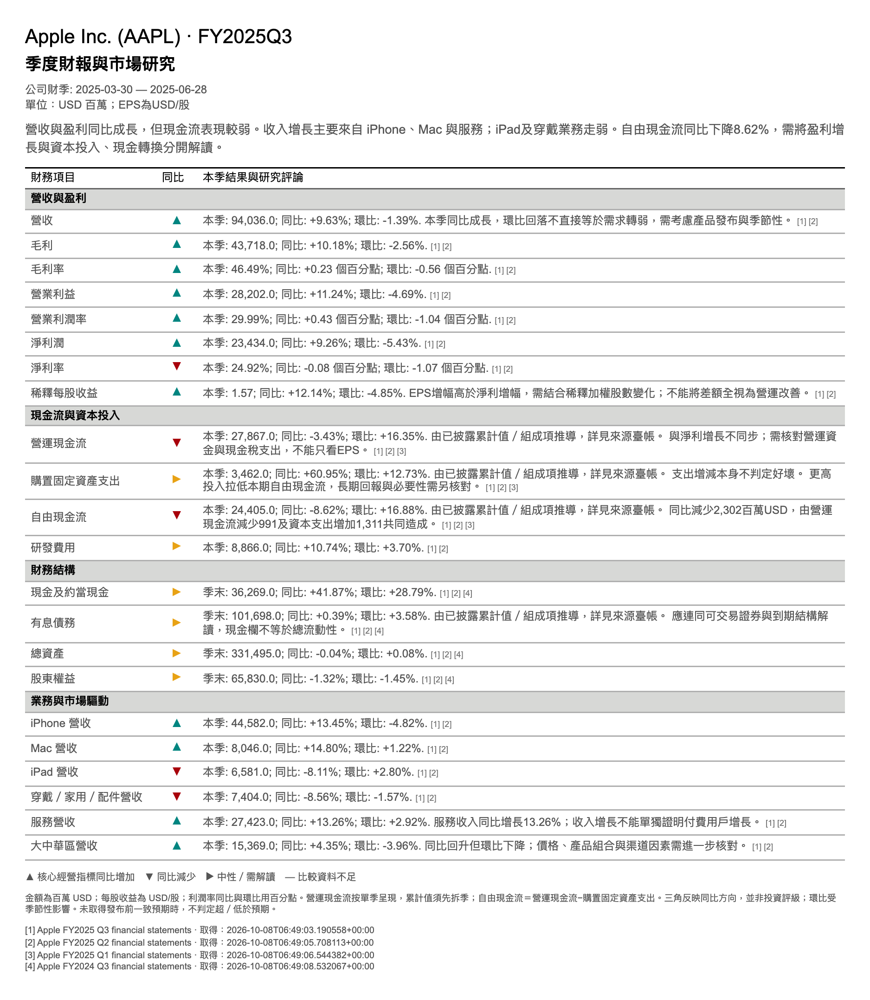
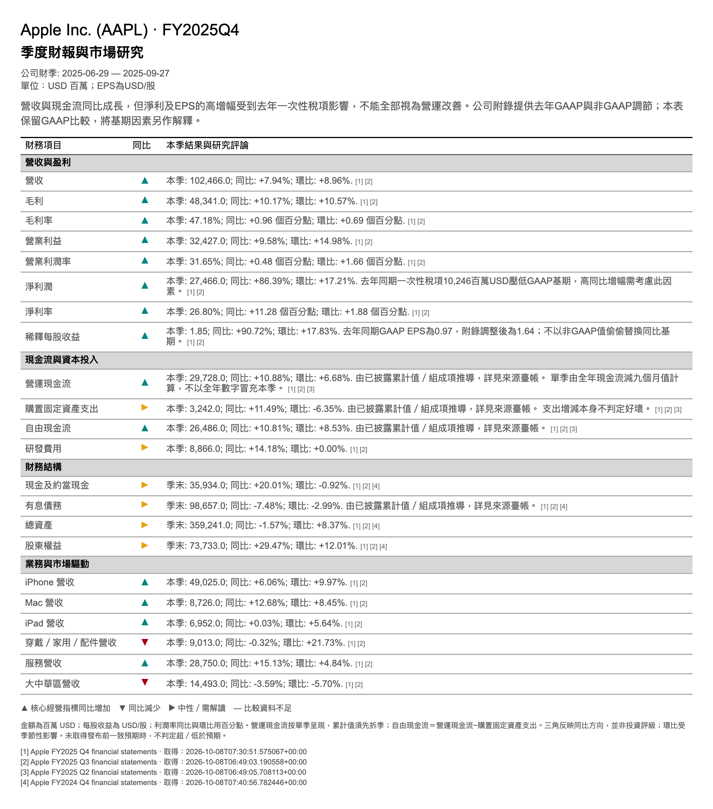
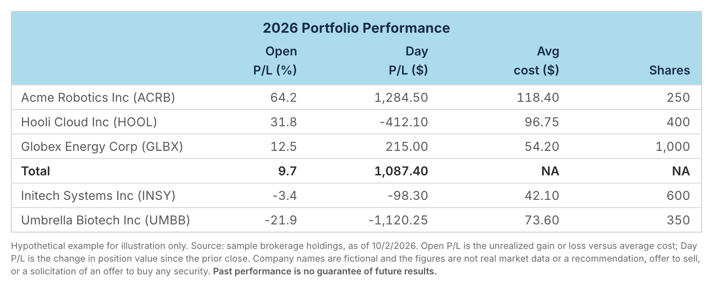
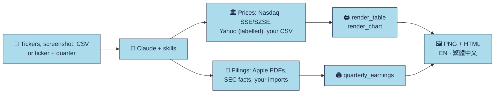

<div align="center">


**Research-desk tables, price charts and quarterly earnings reviews for your AI agent.**

**English** · [繁體中文](README.zh-Hant.md) · [日本語](README.ja.md) · [Français](README.fr.md)

<p><a href="LICENSE"></a> <a href="https://github.com/imoneys10k/schwab-table/actions/workflows/install-test.yml"></a> <a href="https://github.com/imoneys10k/schwab-table/actions/workflows/tests.yml"></a> <a href="https://github.com/imoneys10k/schwab-table/releases"></a> <a href="https://github.com/imoneys10k/schwab-table/stargazers"></a>   </p>

<p><a href="#-install"><b>🚀 Install</b></a> · <a href="#-gallery"><b>🎨 Gallery</b></a> · <a href="https://imoneys10k.github.io/schwab-table/"><b>🌐 Website</b></a> · <a href="https://imoneys10k.github.io/schwab-table/earnings/"><b>🧾 Earnings demo</b></a> · <a href="SKILL.en.md"><b>📘 Skill doc</b></a></p>

</div>

Two Claude skills in one repository. **schwab-performance-table** turns a stock list, a brokerage holdings screenshot, price data or your own CSV into research-desk tables (Schwab, Morgan, Blackstone and IBKR layouts) and into price charts with drawdown and log scale. **quarterly-earnings-review** checks a company's quarterly filing and produces an HSBC-style earnings table with source-backed commentary. Everything is rendered in English and Traditional Chinese, as PNG plus self-contained HTML.

## ✨ Highlights

<table>
<tr><td width="50%" valign="top"><h3>🎯 Four report layouts</h3><p>Schwab, Morgan, Blackstone and IBKR styles with explicit column schemas. Independent templates, not reports issued by those institutions.</p></td><td width="50%" valign="top"><h3>📊 Tables, charts, earnings</h3><p>Ranking, holdings and watchlist tables; line charts and small multiples with drawdown and log scale; HSBC-style quarterly earnings.</p></td></tr>
<tr><td width="50%" valign="top"><h3>🌏 English and Traditional Chinese</h3><p>Every output in both languages: 2x PNG and self-contained HTML, with an optional dark theme and PDF.</p></td><td width="50%" valign="top"><h3>🔒 Sources always shown</h3><p>Nasdaq and Shanghai/Shenzhen exchange closes, clearly labelled Yahoo data for other markets, SEC and Apple filings for earnings. Missing data is NA, never invented.</p></td></tr>
<tr><td width="50%" valign="top"><h3>🤖 One-line agent install</h3><p>Paste a prompt into Claude Code or Codex. Works on macOS, Linux and Windows, and installs both skills.</p></td><td width="50%" valign="top"><h3>🧪 Tested</h3><p>Known-answer unit tests, CI on three operating systems, a live data smoke test and a first round of agent evals.</p></td></tr>
</table>

## 🎨 Gallery

<table>
<tr><td width="50%" align="center"><br><sub><b>Ranking table</b> · EN</sub></td><td width="50%" align="center"><br><sub><b>Watchlist table</b> · 繁體中文</sub></td></tr>
<tr><td width="50%" align="center"><br><sub><b>Line chart with drawdown</b> · EN</sub></td><td width="50%" align="center"><br><sub><b>Small multiples, log scale</b> · 繁體中文</sub></td></tr>
<tr><td width="50%" align="center"><br><sub><b>Morgan-style matrix</b> · 繁體中文</sub></td><td width="50%" align="center"><br><sub><b>Blackstone-style performance</b> · 繁體中文</sub></td></tr>
<tr><td width="50%" align="center"><br><sub><b>IBKR-style holdings</b> · 繁體中文</sub></td><td width="50%" align="center"><br><sub><b>HSBC quarterly earnings, AAPL Q3</b> · 繁體中文</sub></td></tr>
<tr><td width="50%" align="center"><br><sub><b>HSBC quarterly earnings, AAPL Q4</b> · 繁體中文</sub></td><td width="50%" align="center"><br><sub><b>Holdings table</b> · EN</sub></td></tr>
</table>

<sub>The earnings examples use Apple's official filings and the ranking table a public Charles Schwab chart. Everything else uses fictional companies and synthetic data.</sub>

## 🔄 How it works



## 🚀 Install

Works on macOS, Linux and Windows. You need Python 3.9+ (to render); git is optional. The installer registers both skills.

💡 **Easiest way:** paste the prompt below into your AI agent and it installs everything for you.

### 🤖 Let your AI agent install it

Paste this to Claude Code, Codex or any other coding agent:

```text
Install the skills from https://github.com/imoneys10k/schwab-table for me.
Detect my operating system. On macOS or Linux, run:
  curl -fsSL https://raw.githubusercontent.com/imoneys10k/schwab-table/main/install.sh | sh
On Windows, in PowerShell, run:
  irm https://raw.githubusercontent.com/imoneys10k/schwab-table/main/install.ps1 | iex
If I use an agent other than Claude, install into that agent's skills folder instead
(macOS/Linux: add `--dir <path>` after `sh -s --`; Windows: save install.ps1 and run it with -Dir <path>).
When it finishes, confirm that "Render OK" was printed, then tell me to restart so the skills load.
```

### 💻 Or run it yourself

macOS / Linux:

```bash
curl -fsSL https://raw.githubusercontent.com/imoneys10k/schwab-table/main/install.sh | sh
```

Windows (PowerShell):

```powershell
irm https://raw.githubusercontent.com/imoneys10k/schwab-table/main/install.ps1 | iex
```

The installer puts the main skill in `~/.claude/skills/schwab-performance-table` (`%USERPROFILE%\.claude\skills\...` on Windows), creates a private Python virtual environment inside it, installs the dependencies and Chromium (about 100 MB), registers `quarterly-earnings-review` beside it, and renders every table style, a chart and an earnings table as a smoke test. It prints `Render OK` when everything works. Restart Claude afterwards so the skills are picked up. To read a script before running it, open [install.sh](install.sh) or [install.ps1](install.ps1).

| Option (macOS / Linux) | Option (Windows) | Effect |
|---|---|---|
| `--dir PATH` | `-Dir PATH` | Install somewhere else (for example another agent's skills folder). `CLAUDE_SKILLS_DIR` changes the default root. |
| `--ref TAG` | `-Ref TAG` | Install a tag or branch instead of `main`, e.g. `v0.6.1`, to pin a version. Run the installer again without it to return to `main`. |
| `--skip-deps` | `-SkipDeps` | Skip Python, Playwright and Chromium (only fetch and register the files). |
| `--uninstall` | `-Uninstall` | Delete the installed skill folder and the earnings skill registered by it. |

When piping, pass options with `sh -s --`, for example `curl -fsSL .../install.sh | sh -s -- --dir ~/my-skills/schwab`. On Windows, save `install.ps1` and run `.\install.ps1 -Dir C:\path`.

**Update:** run the same command again. **Uninstall:** run it with `--uninstall` (`-Uninstall` on Windows).

**Troubleshooting:** on Debian/Ubuntu install `python3-venv` first. On Linux, if Chromium fails to start, run `sudo <install folder>/.venv/bin/python -m playwright install-deps chromium`. On a minimal Linux server install a CJK font (`sudo apt install fonts-noto-cjk`), otherwise Chinese text renders as boxes.

## 💬 Using it with Claude

Once installed, just ask in plain language, for example:

- Make a performance table for NVDA, AMD and MU.
- Turn this holdings screenshot into a Schwab-style table. (attach the screenshot)
- Chart NVDA, MU and AAPL for this year against the S&P 500.
- Compare these six stocks from March to June on a log scale.
- Show AAPL, MSFT and NVDA in a Morgan-style return and risk matrix.
- Chart 7203.T, 0700.HK and 600519.SS year to date.
- Review AAPL FY2025Q3 in an HSBC-style table.

## 🧩 Table styles

Four layouts, chosen with `--style` (or `spec.style`; the default is Schwab). They are independent templates, not reports issued by or affiliated with the named institutions.

| Style | What it shows | Example |
|---|---|---|
| Schwab · ranking | YTD plus rank in the S&P 500 and NASDAQ (mode A) | [EN](examples/neural9_en.png) · [繁體中文](examples/neural9_zh.png) |
| Schwab · holdings | Open P/L %, today's P/L, average cost, shares, from a screenshot or export (mode B) | [EN](examples/holdings_en.png) · [繁體中文](examples/holdings_zh.png) |
| Schwab · watchlist | Tickers only: YTD, 1-month, 1-year, last close (mode C) | [EN](examples/watchlist_en.png) · [繁體中文](examples/watchlist_zh.png) |
| Morgan | Two periods × return, volatility and drawdown | [EN](examples/morgan_en.png) · [繁體中文](examples/morgan_zh.png) |
| Blackstone | Industry or strategy groups, two return periods | [EN](examples/blackstone_en.png) · [繁體中文](examples/blackstone_zh.png) |
| IBKR | Brokerage fields, market values, weights and supplied exposure | [EN](examples/ibkr_en.png) · [繁體中文](examples/ibkr_zh.png) |

```bash
python3 render_table.py examples/watchlist_spec.json out/watchlist     # Schwab (default)
python3 render_table.py examples/morgan_spec.json out/matrix           # or --style morgan | blackstone | ibkr
python3 prices_to_table.py data/prices.json data/matrix.json --style morgan   # build a matrix from fetched prices
python3 render_table.py data/matrix.json out/matrix
```

Each template has explicit column schemas; passing a five-column watchlist to a seven- or nine-column report does not invent missing facts. Schwab tables and charts keep light and dark modes; the other templates are calibrated for white paper. See the [template guide](references/institutional-tables.md) for schemas, source samples and font substitutions.

## 📊 Price charts

Chart up to 9 symbols over any period (default: year to date) with a drawdown panel and a summary table.

| Layout | Content | Use for |
|---|---|---|
| `lines` | Line chart, drawdown panel, summary table | 2–5 symbols |
| `multiples` | One small chart per symbol on a shared scale, drawdown strip under each | 6–9 symbols |

`layout: auto` picks one by symbol count.

| Symbols | Source | Notes |
|---|---|---|
| US stocks, ETFs, Nasdaq indexes (`NVDA`, `BRK.B`, `SPY`, `COMP`) | Nasdaq official closes | Split-adjusted price return, about 10 years of history |
| Shanghai / Shenzhen (`600519.SS`, `000001.SZ`) | Exchange websites | Unadjusted closes; Shenzhen history is limited |
| Other exchanges and indexes (`7203.T`, `0700.HK`, `SAP.DE`, `^N225`) | Yahoo Finance | Clearly labelled as aggregated data; use the exchange suffix |
| Your own files | `csv_to_prices.py` | Any market; an adjusted-close CSV gives a labelled total-return chart |

- **Benchmark:** SPY by default (labelled as a proxy for the S&P 500), up to two benchmarks (`--benchmark SPY,COMP`), or `--benchmark none`.
- **Axis:** one y-axis, indexed to 100 at the start. It switches to a log scale automatically when the range is wide (or set `y_scale`).
- **Options:** `--theme dark`, `--pdf`, custom line colours, and hover tooltips in the HTML files.

```bash
python3 fetch_prices.py NVDA MU AAPL --start 2026-01-01 -o data/watch.json
python3 fetch_prices.py 7203.T 0700.HK SAP.DE 600519.SS --start 2026-08-01 --benchmark none -o data/global.json
python3 render_chart.py examples/chart_lines_spec.json out/chart
```

## 🧾 Quarterly earnings review

Ask “Review AAPL FY2025Q3 in an HSBC-style table.” The **quarterly-earnings-review** skill verifies the fiscal dates and the primary filing, computes single-quarter, year-over-year and quarter-over-quarter values, and adds commentary that cites its sources. Output is an English and Traditional Chinese PNG + HTML, plus the raw facts and an audit ledger.

- **Sources:** Apple's official financial PDFs (verified live for FY2025Q3 and FY2025Q4); other US-GAAP companies through SEC Company Facts (the parser is covered by fixed fixtures, live access can be refused); other markets through verified official reports imported with `--facts`.
- **Fiscal quarters, not calendar quarters:** the table states the real period dates. Annual or cumulative figures are never relabelled as quarterly facts; missing data stays NA.
- **Commentary:** every comment cites a source ledger ID. No beat/miss claim without consensus evidence; the facts are never overwritten by the analysis.

```bash
python3 quarterly_earnings.py AAPL --period FY2025Q3 -o out/aapl_q3
```

[Try the two-quarter demo](https://imoneys10k.github.io/schwab-table/earnings/) · [Usage and source coverage](EARNINGS.md, in Traditional Chinese) · [Skill](skills/quarterly-earnings-review/SKILL.md)

## 🔍 Data and honesty rules

- **Sources are always printed** in the footnote with the cutoff and retrieval dates. Unavailable history is reported, never silently shortened.
- **`null` is not zero.** Missing data renders as `NA`; nothing is filled from memory or guessed.
- **Price return only from automatic sources.** Nasdaq dividend amounts are not split-adjusted and ETFs have none, so total return needs your own adjusted-close CSV.
- **Yahoo is labelled as aggregated data**, not as exchange-published closes. A-share website prices are unadjusted; the tools warn about corporate-action distortion.
- **Hong Kong and other markets need the exchange suffix** (`0700.HK`); bare numeric codes are ambiguous and rejected.
- Details for agents are in [SKILL.md](SKILL.md) (Traditional Chinese) and [SKILL.en.md](SKILL.en.md) (English).

<details>
<summary><b>📁 Files</b></summary>

- `SKILL.md`, `SKILL.en.md`: The skill Claude loads (Traditional Chinese) and its English translation
- `skills/quarterly-earnings-review/`: The earnings skill, registered beside the main skill by the installers
- `install.sh`, `install.ps1`, `install_earnings_skill.py`: One-click installers for macOS / Linux and Windows, and the earnings skill registration
- `render_table.py`, `institutional_tables.py`, `prices_to_table.py`: Table renderer and its four styles; builds Morgan / Blackstone specs from fetched prices
- `fetch_prices.py`, `csv_to_prices.py`: Daily closes from Nasdaq, Shanghai/Shenzhen and Yahoo; conversion of your own CSV files
- `render_chart.py`, `render_common.py`: Chart renderer; shared themes and PNG / PDF output
- `quarterly_earnings.py`, `earnings_core.py`, `earnings_sources.py`, `render_earnings.py`: Earnings command, audited arithmetic, source adapters and the HSBC-style renderer
- `localization.py`, `fonts.py`, `fonts/`: Traditional Chinese conversion; bundled fonts embedded in the HTML (licences included)
- `references/`, `EARNINGS.md`: Template guide; earnings usage and source coverage (Traditional Chinese)
- `examples/`, `docs/`: Specs and rendered examples (`sample_prices.json` is synthetic); the GitHub Pages site
- `tests/`, `evals/`: Unit tests; realistic agent requests, a trigger-test set and results
- `tools/build_docs.py`: Generates these READMEs and the website from one content table
- `requirements.txt`, `CHANGELOG.md`, `CONTRIBUTING.md`, `assets/`: Dependencies, history, contribution rules, banner and social card

</details>

<details>
<summary><b>🔧 Manual rendering</b></summary>

If you used the installer, the scripts switch to the private virtual environment automatically, so plain `python3 render_table.py ...` works. Otherwise Python 3.9+ is required:

```bash
pip install -r requirements.txt && playwright install chromium
python3 render_table.py examples/neural9_spec.json out/neural9
python3 render_table.py examples/morgan_spec.json out/matrix
python3 fetch_prices.py NVDA MU AAPL --start 2026-01-01 -o data/watch.json
python3 render_chart.py examples/chart_lines_spec.json out/chart --theme dark --pdf
python3 csv_to_prices.py 0700.HK=tencent.csv --benchmark HSI=hsi.csv -o data/hk.json
python3 quarterly_earnings.py AAPL --period FY2025Q3 -o out/aapl_q3
```

Options for both renderers: `--langs en` renders only the listed languages (comma-separated, `zh` is Traditional Chinese and the `_zh` file names are kept), `--no-png` writes HTML only and needs no browser, `--scale 3` raises the PNG resolution (default 2, which gives 1520 px wide), `--theme dark` and `--pdf`. Missing output folders are created.

`fetch_prices.py` caches responses for up to 12 hours (`--refresh` bypasses the cache) and reuses a cache only if it already has the newest expected close. If the network fails it falls back to the last cache with a warning. `index:COMP` / `etf:SPY` force the asset class when a code is ambiguous. Charts take two steps: fetch, then render; pass `--start` / `--end` for a period.

Fonts: Inter, Source Sans 3 and Droid Sans are bundled and embedded for Latin text; Chinese text uses the system Traditional Chinese font. Source-font substitutions are documented in [the template guide](references/institutional-tables.md). Proprietary fonts from reference PDFs or macOS are not distributed.

</details>

## 🧪 Tests and evals

`python3 -m unittest discover -s tests -v` runs known-answer tests for returns, drawdown, volatility, symbol routing, cache freshness, CSV import, table styles and earnings arithmetic. CI runs them on Ubuntu, macOS and Windows (Python 3.9 and 3.13), regenerates the examples to check they are unchanged, runs a live Nasdaq smoke test, and installs the skills on all three systems. [evals/](evals/README.md) holds realistic agent requests and the first results. The READMEs and the website are generated by `python3 tools/build_docs.py`, and a test fails if they are out of date.

## 📌 Disclaimer

This project formats data and does not provide investment advice. Examples use fictional companies and synthetic values unless the gallery note says otherwise. The report layouts are independent templates, not reports issued by the named institutions.

## 📄 License

[MIT](LICENSE)

<div align="center"><sub>⭐ If this saves you time, a star helps others find it.</sub></div>
