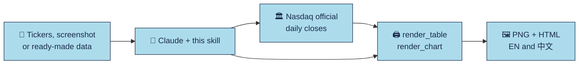

<div align="center">


**Research-desk tables and price charts for your AI agent.**

**English** · [繁體中文](README.zh-Hant.md) · [日本語](README.ja.md) · [Français](README.fr.md)

<p><a href="LICENSE"></a> <a href="https://github.com/imoneys10k/schwab-table/actions/workflows/install-test.yml"></a> <a href="https://github.com/imoneys10k/schwab-table/releases"></a> <a href="https://github.com/imoneys10k/schwab-table/stargazers"></a> <a href="https://github.com/imoneys10k/schwab-table/actions/workflows/tests.yml"></a>   </p>

<p><a href="#-install"><b>🚀 Install</b></a> · <a href="#-gallery"><b>🎨 Gallery</b></a> · <a href="https://imoneys10k.github.io/schwab-table/"><b>🌐 Website</b></a> · <a href="SKILL.en.md"><b>📘 Skill doc</b></a></p>

</div>

A Claude Skill that turns a stock list, a brokerage holdings screenshot, or ready-made return/rank data into a Charles Schwab research-style performance table, and charts several symbols over any period with the same look. Everything is rendered in both Chinese and English (PNG + HTML).

## ✨ Highlights

<table>
<tr><td width="50%" valign="top"><h3>🎯 Research-desk look</h3><p>Light-blue title band, thin grey rules and small-print footnotes, like a broker research note.</p></td><td width="50%" valign="top"><h3>📊 Tables and charts</h3><p>Ranking, holdings and watchlist tables, plus line charts and small multiples with drawdown and log scale.</p></td></tr>
<tr><td width="50%" valign="top"><h3>🌏 Bilingual by default</h3><p>Every output in Chinese and English: 2x PNG and self-contained HTML.</p></td><td width="50%" valign="top"><h3>🔒 Explicit data sources</h3><p>Exchange closes plus clearly labelled Yahoo global data. Missing data is marked NA, never made up.</p></td></tr>
<tr><td width="50%" valign="top"><h3>🤖 One-line agent install</h3><p>Paste a prompt into Claude Code or Codex. Works on macOS, Linux and Windows.</p></td><td width="50%" valign="top"><h3>🔤 Embedded report fonts</h3><p>Inter, Source Sans 3 and Droid Sans are bundled and embedded, for stable Latin text; source-font substitutions are documented.</p></td></tr>
</table>

## 🎨 Gallery

<table>
<tr><td width="50%" align="center"><br><sub><b>Ranking table</b> · EN</sub></td><td width="50%" align="center"><br><sub><b>Watchlist table</b> · 中文</sub></td></tr>
<tr><td width="50%" align="center"><br><sub><b>Line chart with drawdown</b> · EN</sub></td><td width="50%" align="center"><br><sub><b>Small multiples, log scale</b> · 中文</sub></td></tr>
</table>

<sub>The examples use fictional companies and synthetic data, except the ranking table (a public Charles Schwab chart).</sub>

## 🔄 How it works



## Institutional report templates

Four report styles are available: Schwab (default), Morgan-style return/risk matrix,
Blackstone-style grouped performance and IBKR-style holdings/exposure. All Chinese
output now uses **Traditional Chinese**, including charts; existing `zh` specs
and `_zh` filenames still work.

| Style | Example | Purpose |
| --- | --- | --- |
| `schwab` | [Watchlist](examples/watchlist_zh.png) | Existing ranking, watchlist and P/L tables |
| `morgan` | [Matrix](examples/morgan_zh.png) | Two periods × return, volatility and drawdown |
| `blackstone` | [Grouped returns](examples/blackstone_zh.png) | Industry/strategy groups, two return periods |
| `ibkr` | [Holdings](examples/ibkr_zh.png) | Brokerage fields, market values, weights and supplied exposure |

```bash
python3 render_table.py examples/morgan_spec.json out/matrix
python3 render_table.py examples/blackstone_spec.json out/grouped
python3 render_table.py examples/ibkr_spec.json out/holdings
# Prepare a matrix from the existing free daily-price data:
python3 prices_to_table.py data/prices.json data/matrix.json --style morgan
python3 render_table.py data/matrix.json out/matrix
```

Templates have explicit column schemas; passing a five-column watchlist to a
seven/nine-column report does not invent missing facts. See
[template schemas, source samples and font substitutions](references/institutional-tables.md).
New templates are calibrated for white paper; Schwab tables and charts retain
light/dark modes. Examples use fictional companies and synthetic values.

## 🚀 Install

Works on macOS, Linux and Windows. You need Python 3.9+ (to render tables); git is optional.

💡 **Easiest way:** paste the prompt below into your AI agent and it installs everything for you.

### 🤖 Let your AI agent install it

Paste this to Claude Code, Codex or any other coding agent:

```text
Install the skill from https://github.com/imoneys10k/schwab-table for me.
Detect my operating system. On macOS or Linux, run:
  curl -fsSL https://raw.githubusercontent.com/imoneys10k/schwab-table/main/install.sh | sh
On Windows, in PowerShell, run:
  irm https://raw.githubusercontent.com/imoneys10k/schwab-table/main/install.ps1 | iex
If I use an agent other than Claude, install into that agent's skills folder instead
(macOS/Linux: add `--dir <path>` after `sh -s --`; Windows: save install.ps1 and run it with -Dir <path>).
When it finishes, confirm that "Render OK" was printed, then tell me to restart so the skill loads.
```

### 💻 Or run it yourself

macOS / Linux:

```bash
curl -fsSL https://raw.githubusercontent.com/imoneys10k/schwab-table/main/install.sh | sh
```

Windows (PowerShell):

```powershell
irm https://raw.githubusercontent.com/imoneys10k/schwab-table/main/install.ps1 | iex
```

The installer puts the skill in `~/.claude/skills/schwab-performance-table` (`%USERPROFILE%\.claude\skills\...` on Windows), creates a private Python virtual environment inside it, installs Playwright and Chromium (about 100 MB), and renders the example table as a smoke test. It prints `Render OK` when everything works. Restart Claude afterwards so the skill is picked up. To read the script before running it, open [install.sh](install.sh) or [install.ps1](install.ps1).

| Option (macOS / Linux) | Option (Windows) | Effect |
|---|---|---|
| `--dir PATH` | `-Dir PATH` | Install somewhere else (for example another agent's skills folder). `CLAUDE_SKILLS_DIR` changes the default root. |
| `--ref TAG` | `-Ref TAG` | Install a tag or branch instead of `main`, e.g. `v0.4.0`, to pin a version |
| `--skip-deps` | `-SkipDeps` | Skip Python / Playwright / Chromium (only fetch the files) |
| `--uninstall` | `-Uninstall` | Delete the installed skill folder |

When piping, pass options with `sh -s --`, for example `curl -fsSL .../install.sh | sh -s -- --dir ~/my-skills/schwab`. On Windows, save `install.ps1` and run `.\install.ps1 -Dir C:\path`.

**Update:** run the same command again. **Uninstall:** run it with `--uninstall` (`-Uninstall` on Windows).

**Troubleshooting:** on Debian/Ubuntu install `python3-venv` first; on Linux, if Chromium fails to start, run `sudo <install folder>/.venv/bin/python -m playwright install-deps chromium`.

## 💬 Using it with Claude

Once installed, just ask in plain language, for example:

- Make a performance table for NVDA, AMD and MU.
- Turn this holdings screenshot into a Schwab-style table. (attach the screenshot)
- Make a 2026 Neural9 ranking table from this data.
- Chart NVDA, MU and AAPL for this year.
- Compare these six stocks from March to June on a log scale.

## 🧩 Three modes

| Mode | Input | Columns 2–5 | Example |
|---|---|---|---|
| A. Ranking table | Each stock's YTD return and its rank within the S&P 500 / NASDAQ | YTD, S&P 500 performance rank, S&P 500 contribution rank, NASDAQ performance rank | [EN](examples/neural9_en.png) · [中文](examples/neural9_zh.png) |
| B. Holdings table | A brokerage holdings screenshot or export | Open P/L %, today's P/L, average cost, shares | [EN](examples/holdings_en.png) · [中文](examples/holdings_zh.png) |
| C. Watchlist table | Tickers only | YTD, 1-month, 1-year, latest close | [EN](examples/watchlist_en.png) · [中文](examples/watchlist_zh.png) |

Mode A uses data from a public Charles Schwab chart. The mode B and C examples use fictional companies and made-up numbers, for illustration only.

## 📊 Price charts

Chart up to 9 symbols over any period (default: year to date) in the same research-note style, with a drawdown panel and a summary table. Chinese and English versions, PNG + HTML. The examples use fictional companies and synthetic data.

| Layout | Content | Use for |
|---|---|---|
| `lines` | Line chart, drawdown panel, summary table | 2–5 symbols |
| `multiples` | One small chart per symbol on a shared scale, drawdown strip under each | 6–9 symbols |

`layout: auto` picks one by symbol count.

- **Data:** US listings use Nasdaq; Shanghai/Shenzhen use official exchange website closes (unadjusted); other markets use Yahoo Finance (aggregated). Each listing keeps its currency and last trading date. SPY remains the default benchmark; use `--benchmark none` for a global chart without one.
- **Axis:** one y-axis, indexed to 100 at the start. It switches to a log scale automatically when the range is wide (or set `y_scale` yourself).
- **Your own data:** `csv_to_prices.py` turns CSV files (broker exports, Hong Kong or A-share prices, adjusted closes for total return) into the same format.
- **Options:** `--theme dark`, `--pdf`, several benchmarks (`--benchmark SPY,COMP`), custom line colours, and hover tooltips in the HTML files.

```bash
python3 fetch_prices.py NVDA MU AAPL --start 2026-01-01 -o data/watch.json
python3 fetch_prices.py 7203.T 0700.HK SAP.DE 600519.SS 000001.SZ --start 2026-08-01 --benchmark none -o data/global.json
python3 render_chart.py examples/chart_lines_spec.json out/chart   # copy and edit the spec for your own data
```

## 🔍 Data sources

US and Shanghai/Shenzhen prices use exchange sources; global daily prices may use Yahoo Finance, explicitly labelled as aggregated. Company IR, SEC and official index sources remain preferred. A-share website prices are unadjusted and Shenzhen history is limited; unavailable history is reported, never silently shortened. See [SKILL.md](SKILL.md) and [SKILL.en.md](SKILL.en.md).

<details>
<summary><b>📁 Files</b></summary>

- `SKILL.md`: the skill definition Claude loads (structure, visual parameters, data-source rules, checklist), in Chinese
- `SKILL.en.md`: English translation of `SKILL.md`, for human readers
- `install.sh` / `install.ps1`: one-click installers for macOS / Linux and Windows
- `render_table.py`: the table renderer. Reads a JSON spec and writes Chinese and English HTML plus 2x PNG
- `fetch_prices.py`: market-routed daily closes from Nasdaq, Shanghai/Shenzhen and Yahoo (standard library only)
- `csv_to_prices.py`: converts your own CSV price files into the format `render_chart.py` reads
- `render_common.py`: shared colour themes and PNG / PDF rendering
- `tests/`: unit tests for the calculations and parsers (`python3 -m unittest discover -s tests`)
- `evals/`: realistic test requests, a trigger-test set and the results of the first eval run
- `render_chart.py`: the chart renderer. Reads the fetched prices plus a JSON spec
- `fonts.py`, `fonts/`: the bundled Inter font (SIL OFL), embedded into every HTML file
- `requirements.txt`: Python dependency (Playwright)
- `examples/`: a spec plus rendered output for each of the three table modes and both chart layouts (`sample_prices.json` is synthetic)
- `assets/`: social preview image

</details>

<details>
<summary><b>🔧 Manual rendering</b></summary>

If you used the installer, `render_table.py` automatically switches to its virtual environment, so plain `python3 render_table.py ...` works. Otherwise, Python 3.9+ is required:

```bash
pip install -r requirements.txt && playwright install chromium
python3 render_table.py examples/neural9_spec.json out/neural9
```

Options (both renderers): `--langs en` renders only the listed languages (comma-separated); `--no-png` writes HTML only and does not need Playwright; `--scale 3` raises the PNG resolution (default 2, which gives 1520 px wide). Missing output folders are created automatically.

Charts take two steps: fetch the prices, then render. Pass `--start` / `--end` for a period; the default is year to date. `--benchmark COMP` uses the Nasdaq Composite instead of SPY.

```bash
python3 fetch_prices.py NVDA MU AAPL --start 2026-01-01 -o data/watch.json
python3 fetch_prices.py 7203.T 0700.HK SAP.DE 600519.SS 000001.SZ --start 2026-08-01 --benchmark none -o data/global.json
python3 render_chart.py examples/chart_lines_spec.json out/chart   # copy and edit the spec for your own data
python3 render_chart.py examples/chart_lines_spec.json out/chart --theme dark --pdf   # dark theme and a vector PDF
python3 csv_to_prices.py 0700.HK=tencent.csv --benchmark HSI=hsi.csv -o data/hk.json   # your own CSV files
```

`fetch_prices.py` caches responses for 12 hours (`--refresh` bypasses the cache) and falls back to the last cache if the network fails, with a warning. `index:COMP` / `etf:SPY` force the asset class when a code is ambiguous. Both renderers also take `--theme dark` and `--pdf`.

Fonts: Inter, Source Sans 3 and Droid Sans are bundled and embedded for Latin text. Source-font substitutions and system Traditional Chinese fallbacks are documented in [the template guide](references/institutional-tables.md). Install `fonts-noto-cjk` on a minimal Linux system. Original proprietary PDF fonts and macOS font files are not distributed.

</details>

## 📌 Disclaimer

This project only generates table styling and does not provide investment advice. The data in the examples is for illustration only.

## 📄 License

[MIT](LICENSE)

<div align="center"><sub>⭐ If this saves you time, a star helps others find it.</sub></div>

## Local quarterly earnings development

This branch adds an HSBC-style quarterly earnings review skill. See [EARNINGS.md](EARNINGS.md) for source coverage, usage, reproducible examples, and validation. It is not part of the public v0.5.0 release.
