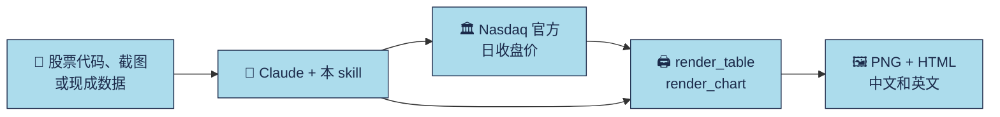

<div align="center">


**给 AI Agent 用的研报风格表格与走势图。**

[English](README.md) · **简体中文** · [日本語](README.ja.md) · [Français](README.fr.md)

<p><a href="LICENSE"></a> <a href="https://github.com/imoneys10k/schwab-table/actions/workflows/install-test.yml"></a> <a href="https://github.com/imoneys10k/schwab-table/releases"></a> <a href="https://github.com/imoneys10k/schwab-table/stargazers"></a> <a href="https://github.com/imoneys10k/schwab-table/actions/workflows/tests.yml"></a>   </p>

<p><a href="#-安装"><b>🚀 安装</b></a> · <a href="#-效果图"><b>🎨 效果图</b></a> · <a href="https://imoneys10k.github.io/schwab-table/"><b>🌐 项目主页</b></a> · <a href="SKILL.en.md"><b>📘 Skill 文档</b></a></p>

</div>

一个 Claude Skill：把股票清单、券商持仓截图或现成的涨跌幅/排名数据，做成 Charles Schwab 研报风格的业绩表；还能用同样的风格画出若干标的在任意时间段内的走势图。全部同时输出中文版和英文版（PNG + HTML）。

## ✨ 亮点

<table>
<tr><td width="50%" valign="top"><h3>🎯 研报风格</h3><p>浅蓝标题带、灰色细线、小字脚注，和券商研报里的表格一个味道。</p></td><td width="50%" valign="top"><h3>📊 表格加走势图</h3><p>排名表、持仓表、自选股表，以及带回撤和对数刻度的线图、小图矩阵。</p></td></tr>
<tr><td width="50%" valign="top"><h3>🌏 默认中英双版</h3><p>每次都输出中文和英文两版：2x PNG 加独立的 HTML。</p></td><td width="50%" valign="top"><h3>🔒 只用权威数据</h3><p>只用交易所官方收盘价，不用聚合站数字。缺的数据写 NA，绝不编造。</p></td></tr>
<tr><td width="50%" valign="top"><h3>🤖 一句话让 Agent 安装</h3><p>把提示词发给 Claude Code 或 Codex 就行，支持 macOS、Linux、Windows。</p></td><td width="50%" valign="top"><h3>🔤 各处字体一致</h3><p>附带 Inter 字体并嵌入每个 HTML，换台机器效果也一样。</p></td></tr>
</table>

## 🎨 效果图

<table>
<tr><td width="50%" align="center"><br><sub><b>排名表</b> · EN</sub></td><td width="50%" align="center"><br><sub><b>自选股表</b> · 中文</sub></td></tr>
<tr><td width="50%" align="center"><br><sub><b>带回撤的线图</b> · EN</sub></td><td width="50%" align="center"><br><sub><b>小图矩阵（对数刻度）</b> · 中文</sub></td></tr>
</table>

<sub>除排名表（来自 Charles Schwab 公开图表）外，示例都使用虚构公司和合成数据。</sub>

## 🔄 工作流程



## 🚀 安装

支持 macOS、Linux 和 Windows。需要 Python 3.9+（用于渲染表格），git 可选。

💡 **最省事的办法：** 把下面的提示词直接发给你的 AI Agent，它会替你装好。

### 🤖 让 AI Agent 帮你安装

把下面这段话直接发给 Claude Code、Codex 或其他编程 Agent：

```text
请帮我安装 https://github.com/imoneys10k/schwab-table 这个 skill。
先判断我的操作系统。macOS 或 Linux 运行：
  curl -fsSL https://raw.githubusercontent.com/imoneys10k/schwab-table/main/install.sh | sh
Windows 在 PowerShell 里运行：
  irm https://raw.githubusercontent.com/imoneys10k/schwab-table/main/install.ps1 | iex
如果我用的不是 Claude，请装到那个 Agent 自己的 skills 目录
（macOS/Linux 在 `sh -s --` 后面加 `--dir <路径>`；Windows 先保存 install.ps1，再用 -Dir <路径> 运行）。
装完确认输出了 "Render OK"，然后提醒我重启，让 skill 生效。
```

### 💻 或者自己运行

macOS / Linux：

```bash
curl -fsSL https://raw.githubusercontent.com/imoneys10k/schwab-table/main/install.sh | sh
```

Windows（PowerShell）：

```powershell
irm https://raw.githubusercontent.com/imoneys10k/schwab-table/main/install.ps1 | iex
```

安装脚本会把 skill 放进 `~/.claude/skills/schwab-performance-table`（Windows 为 `%USERPROFILE%\.claude\skills\...`），在里面创建独立的 Python 虚拟环境，安装 Playwright 和 Chromium（约 100 MB），再渲染一张示例表做冒烟测试。一切正常时会输出 `Render OK`。装完重启 Claude，skill 才会被加载。想先看脚本内容，可以打开 [install.sh](install.sh) 或 [install.ps1](install.ps1)。

| 选项（macOS / Linux） | 选项（Windows） | 作用 |
|---|---|---|
| `--dir PATH` | `-Dir PATH` | 装到别处（比如其他 Agent 的 skills 目录）。环境变量 `CLAUDE_SKILLS_DIR` 可修改默认根目录 |
| `--ref TAG` | `-Ref TAG` | 安装指定的标签或分支而不是 `main`，例如 `v0.4.0`，用来固定版本 |
| `--skip-deps` | `-SkipDeps` | 跳过 Python / Playwright / Chromium，只下载文件 |
| `--uninstall` | `-Uninstall` | 删除已安装的 skill 文件夹 |

用管道运行时，选项要放在 `sh -s --` 后面，例如 `curl -fsSL .../install.sh | sh -s -- --dir ~/my-skills/schwab`。Windows 请先保存 `install.ps1`，再运行 `.\install.ps1 -Dir C:\path`。

**更新：** 再运行一遍同样的命令。**卸载：** 加上 `--uninstall` 运行（Windows 用 `-Uninstall`）。

**常见问题：** Debian/Ubuntu 需要先装 `python3-venv`；Linux 上 Chromium 启动失败时，运行 `sudo <安装目录>/.venv/bin/python -m playwright install-deps chromium`。

## 💬 在 Claude 里使用

安装后直接用自然语言说就行，例如：

- 帮我给 NVDA、AMD、MU 做个业绩表。
- 把这张持仓截图做成 Schwab 风格的表。（附上截图）
- 用这份数据做一张 2026 年 Neural9 排名表。
- 帮我画 NVDA、MU、AAPL 今年的走势图。
- 把这六只股票 3 月到 6 月的走势用对数刻度对比一下。

## 🧩 三种模式

| 模式 | 输入 | 第 2–5 列 | 示例 |
|---|---|---|---|
| A 排名表 | 每只股票的 YTD 和 S&P 500 / NASDAQ 内排名 | YTD、S&P 500 涨幅排名、S&P 500 贡献排名、NASDAQ 涨幅排名 | [EN](examples/neural9_en.png) · [中文](examples/neural9_zh.png) |
| B 持仓表 | 券商持仓截图或导出 | 开仓盈亏 %、当日盈亏、平均成本、持股数 | [EN](examples/holdings_en.png) · [中文](examples/holdings_zh.png) |
| C 自选股表 | 只有股票代码 | 年初至今、近 1 月、近 1 年、最新收盘价 | [EN](examples/watchlist_en.png) · [中文](examples/watchlist_zh.png) |

模式 A 的数据来自 Charles Schwab 公开图表；模式 B、C 的示例使用虚构公司和编造数字，仅作演示。

## 📊 走势图

最多 9 只标的、任意时间段（默认年初至今），同样的研报风格，带回撤面板和汇总表，中英双版（PNG + HTML）。示例使用虚构公司和合成数据。

| 版式 | 内容 | 适用 |
|---|---|---|
| `lines` | 折线图、回撤面板、汇总表 | 2–5 只 |
| `multiples` | 每只一个小图，同一纵轴，下方带回撤条 | 6–9 只 |

`layout: auto` 会按标的数量自动选择。

- **数据：** Nasdaq 官方历史行情接口：交易所官方日收盘价，已按拆股复权，价格回报，约 10 年。基准默认用 SPY，图上标注为标普 500 的替代。不使用其他来源。
- **纵轴：** 只有一个纵轴，起点为 100。涨幅差距很大时自动改用对数刻度（也可用 `y_scale` 手动指定）。
- **自己的数据：** `csv_to_prices.py` 可以把 CSV 文件（券商导出、港股或 A 股价格、用于总回报的复权价）转成同样的格式。
- **选项：** `--theme dark` 深色主题、`--pdf` 矢量 PDF、多个基准（`--benchmark SPY,COMP`）、自定义线条颜色，HTML 文件里还有鼠标悬停提示。

```bash
python3 fetch_prices.py NVDA MU AAPL --start 2026-01-01 -o data/watch.json
python3 render_chart.py examples/chart_lines_spec.json out/chart   # copy and edit the spec for your own data
```

## 🔍 数据源

只用权威数据：交易所官方收盘价、指数编制方（S&P Dow Jones Indices、Nasdaq Global Indexes，可经 FRED 转载）、公司 IR / SEC 文件，或用户自己的券商数据。回报由官方收盘价计算，不采用聚合网站上的现成涨跌幅。详见 [SKILL.md](SKILL.md)（中文原文；英文译本见 [SKILL.en.md](SKILL.en.md)）。

<details>
<summary><b>📁 文件</b></summary>

- `SKILL.md`：Claude 实际加载的 Skill 说明（结构、视觉参数、数据源规定、自查清单）
- `SKILL.en.md`：`SKILL.md` 的英文译本，供人阅读
- `install.sh` / `install.ps1`：一键安装脚本（macOS / Linux 与 Windows）
- `render_table.py`：表格渲染器，读 JSON spec，输出中英文 HTML 和 2x PNG
- `fetch_prices.py`：从 Nasdaq 官方接口下载日收盘价（仅用标准库）
- `csv_to_prices.py`：把你自己的 CSV 价格文件转成 `render_chart.py` 能读的格式
- `render_common.py`：共用的配色主题和 PNG / PDF 渲染
- `tests/`：计算和解析逻辑的单元测试（`python3 -m unittest discover -s tests`）
- `render_chart.py`：走势图渲染器，读取下载的价格和 JSON spec
- `fonts.py`、`fonts/`：随仓库附带的 Inter 字体（SIL OFL），嵌入每个 HTML 文件
- `requirements.txt`：Python 依赖（Playwright）
- `examples/`：三种表格模式和两种图表版式各一份 spec 和渲染结果（`sample_prices.json` 为合成数据）
- `assets/`：社交预览图

</details>

<details>
<summary><b>🔧 手动渲染</b></summary>

如果用安装脚本装的，`render_table.py` 会自动切换到它的虚拟环境，直接 `python3 render_table.py ...` 就行。否则需要 Python 3.9 及以上：

```bash
pip install -r requirements.txt && playwright install chromium
python3 render_table.py examples/neural9_spec.json out/neural9
```

可选参数（两个渲染器通用）：`--langs en` 只渲染指定语言（逗号分隔）；`--no-png` 只写 HTML，不需要 Playwright；`--scale 3` 提高 PNG 清晰度（默认 2，即 1520 px 宽）。输出目录不存在时会自动创建。

走势图分两步：先下载价格，再渲染。用 `--start` / `--end` 指定时间段，默认年初至今；`--benchmark COMP` 可把基准从 SPY 换成纳斯达克综合指数。

```bash
python3 fetch_prices.py NVDA MU AAPL --start 2026-01-01 -o data/watch.json
python3 render_chart.py examples/chart_lines_spec.json out/chart   # 复制并修改 spec 用于你自己的数据
python3 render_chart.py examples/chart_lines_spec.json out/chart --theme dark --pdf   # 深色主题和矢量 PDF
python3 csv_to_prices.py 0700.HK=tencent.csv --benchmark HSI=hsi.csv -o data/hk.json   # 你自己的 CSV 文件
```

`fetch_prices.py` 会把响应缓存 12 小时（`--refresh` 可绕过缓存），网络失败时会带警告地使用上一次的缓存。代码有歧义时，可用 `index:COMP`、`etf:SPY` 指定资产类别。两个渲染器都支持 `--theme dark` 和 `--pdf`。

字体：Inter（随仓库放在 `fonts/`，SIL 开源字体许可）会嵌入每个 HTML 文件，用于英文和数字，所以在任何机器上效果一致。中文使用系统自带的中文字体（macOS 为苹方，Windows 为微软雅黑）。精简的 Linux 服务器上请先装一个，例如 `sudo apt install fonts-noto-cjk`，否则中文版会显示成方块。

</details>

## 📌 免责声明

本项目只生成表格样式，不提供任何投资建议。表中数据仅作示例。

## 📄 许可证

[MIT](LICENSE)

<div align="center"><sub>⭐ 如果它帮你省了时间，点个 star 能让更多人看到。</sub></div>
