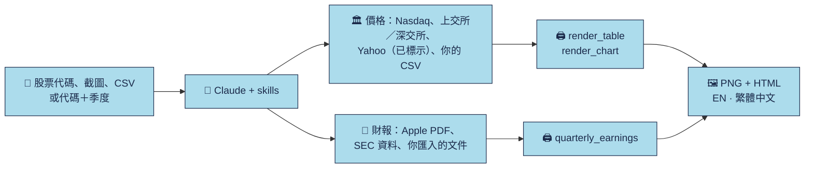

<div align="center">


**給 AI Agent 用的研報風格表格、走勢圖與季度財報解讀。**

[English](README.md) · **繁體中文** · [日本語](README.ja.md) · [Français](README.fr.md)

<p><a href="LICENSE"></a> <a href="https://github.com/imoneys10k/schwab-table/actions/workflows/install-test.yml"></a> <a href="https://github.com/imoneys10k/schwab-table/actions/workflows/tests.yml"></a> <a href="https://github.com/imoneys10k/schwab-table/releases"></a> <a href="https://github.com/imoneys10k/schwab-table/stargazers"></a>   </p>

<p><a href="#-安裝"><b>🚀 安裝</b></a> · <a href="#-效果圖"><b>🎨 效果圖</b></a> · <a href="https://imoneys10k.github.io/schwab-table/"><b>🌐 專案網站</b></a> · <a href="https://imoneys10k.github.io/schwab-table/earnings/"><b>🧾 財報示範</b></a> · <a href="SKILL.md"><b>📘 Skill 文件</b></a></p>

</div>

同一個儲存庫裡有兩個 Claude skill。**schwab-performance-table** 把股票清單、券商持倉截圖、價格資料或你自己的 CSV，做成研報風格的表格（Schwab、摩根士丹利、黑石、IBKR 版式），也能畫帶回撤和對數刻度的走勢圖。**quarterly-earnings-review** 核對公司的季度財報原件，輸出 HSBC 版式的財報表與有來源支持的解讀。所有輸出都有繁體中文與英文兩版，格式為 PNG 加獨立的 HTML。

## ✨ 亮點

<table>
<tr><td width="50%" valign="top"><h3>🎯 四種報表版式</h3><p>Schwab、摩根士丹利、黑石與 IBKR 版式，欄位結構明確。這些是獨立的範本，並非上述機構發布的報告。</p></td><td width="50%" valign="top"><h3>📊 表格、走勢圖、財報</h3><p>排名表、持倉表、自選股表；帶回撤與對數刻度的線圖和小圖矩陣；HSBC 版式的季度財報。</p></td></tr>
<tr><td width="50%" valign="top"><h3>🌏 繁體中文與英文</h3><p>每次輸出兩種語言：2x PNG 加獨立 HTML，另可選深色主題與 PDF。</p></td><td width="50%" valign="top"><h3>🔒 來源一定標明</h3><p>Nasdaq 與上海／深圳交易所收盤價、明確標示的 Yahoo 資料（其他市場）、財報用 SEC 與 Apple 官方文件。缺資料寫 NA，絕不編造。</p></td></tr>
<tr><td width="50%" valign="top"><h3>🤖 一句話讓 Agent 安裝</h3><p>把提示詞貼給 Claude Code 或 Codex 即可。支援 macOS、Linux、Windows，兩個 skill 一起裝好。</p></td><td width="50%" valign="top"><h3>🧪 有測試</h3><p>有標準答案的單元測試、三個作業系統的 CI、即時資料冒煙測試，以及第一輪 Agent 評測。</p></td></tr>
</table>

## 🎨 效果圖

<table>
<tr><td width="50%" align="center"><br><sub><b>排名表</b> · EN</sub></td><td width="50%" align="center"><br><sub><b>自選股表</b> · 繁體中文</sub></td></tr>
<tr><td width="50%" align="center"><br><sub><b>帶回撤的線圖</b> · EN</sub></td><td width="50%" align="center"><br><sub><b>小圖矩陣（對數刻度）</b> · 繁體中文</sub></td></tr>
<tr><td width="50%" align="center"><br><sub><b>摩根士丹利矩陣</b> · 繁體中文</sub></td><td width="50%" align="center"><br><sub><b>黑石分組業績</b> · 繁體中文</sub></td></tr>
<tr><td width="50%" align="center"><br><sub><b>IBKR 持倉明細</b> · 繁體中文</sub></td><td width="50%" align="center"><br><sub><b>HSBC 季度財報：AAPL 第三季</b> · 繁體中文</sub></td></tr>
<tr><td width="50%" align="center"><br><sub><b>HSBC 季度財報：AAPL 第四季</b> · 繁體中文</sub></td><td width="50%" align="center"><br><sub><b>持倉表</b> · EN</sub></td></tr>
</table>

<sub>財報示例使用 Apple 官方文件，排名表來自 Charles Schwab 公開圖表，其餘示例使用虛構公司與合成資料。</sub>

## 🔄 運作方式



## 🚀 安裝

支援 macOS、Linux 與 Windows。需要 Python 3.9 以上（用於渲染），git 可有可無。安裝程式會一併註冊兩個 skill。

💡 **最省事的辦法：** 把下面的提示詞直接貼給你的 AI Agent，它會替你裝好。

### 🤖 讓 AI Agent 幫你安裝

把下面這段話貼給 Claude Code、Codex 或其他程式 Agent：

```text
請幫我安裝 https://github.com/imoneys10k/schwab-table 裡的 skill。
先判斷我的作業系統。macOS 或 Linux 執行：
  curl -fsSL https://raw.githubusercontent.com/imoneys10k/schwab-table/main/install.sh | sh
Windows 在 PowerShell 執行：
  irm https://raw.githubusercontent.com/imoneys10k/schwab-table/main/install.ps1 | iex
如果我用的不是 Claude，請裝到那個 Agent 自己的 skills 目錄
（macOS/Linux 在 `sh -s --` 後面加 `--dir <路徑>`；Windows 先儲存 install.ps1，再用 -Dir <路徑> 執行）。
裝完確認輸出了 "Render OK"，然後提醒我重新啟動，讓 skill 生效。
```

### 💻 或自己執行

macOS / Linux:

```bash
curl -fsSL https://raw.githubusercontent.com/imoneys10k/schwab-table/main/install.sh | sh
```

Windows (PowerShell):

```powershell
irm https://raw.githubusercontent.com/imoneys10k/schwab-table/main/install.ps1 | iex
```

安裝程式會把主 skill 放進 `~/.claude/skills/schwab-performance-table`（Windows 為 `%USERPROFILE%\.claude\skills\...`），在裡面建立獨立的 Python 虛擬環境，安裝相依套件與 Chromium（約 100 MB），在旁邊註冊 `quarterly-earnings-review`，再渲染所有表格版式、一張圖和一份財報表作為冒煙測試。一切正常時會輸出 `Render OK`。裝完請重新啟動 Claude，skill 才會載入。想先看腳本內容，可以打開 [install.sh](install.sh) 或 [install.ps1](install.ps1)。

| 選項（macOS / Linux） | 選項（Windows） | 作用 |
|---|---|---|
| `--dir PATH` | `-Dir PATH` | 裝到別處（例如其他 Agent 的 skills 目錄）。環境變數 `CLAUDE_SKILLS_DIR` 可修改預設根目錄。 |
| `--ref TAG` | `-Ref TAG` | 安裝指定的標籤或分支而不是 `main`，例如 `v0.6.1`，用來固定版本。不帶它再執行一次就會回到 `main`。 |
| `--skip-deps` | `-SkipDeps` | 略過 Python、Playwright 與 Chromium（只下載並註冊檔案）。 |
| `--uninstall` | `-Uninstall` | 刪除已安裝的 skill 資料夾，以及由它註冊的財報 skill。 |

用管線執行時，選項要放在 `sh -s --` 後面，例如 `curl -fsSL .../install.sh | sh -s -- --dir ~/my-skills/schwab`。Windows 請先儲存 `install.ps1`，再執行 `.\install.ps1 -Dir C:\path`。

**更新：** 再執行一次同樣的命令。**解除安裝：** 加上 `--uninstall` 執行（Windows 用 `-Uninstall`）。

**常見問題：** Debian/Ubuntu 需要先裝 `python3-venv`。Linux 上 Chromium 無法啟動時，執行 `sudo <安裝目錄>/.venv/bin/python -m playwright install-deps chromium`。精簡的 Linux 伺服器請先裝一套 CJK 字型（`sudo apt install fonts-noto-cjk`），否則中文會顯示成方塊。

## 💬 在 Claude 裡使用

安裝後直接用自然語言說就行，例如：

- 幫我給 NVDA、AMD、MU 做個業績表。
- 把這張持倉截圖做成 Schwab 風格的表。（附上截圖）
- 畫 NVDA、MU、AAPL 今年的走勢圖，並和標普 500 對比。
- 把這六檔股票 3 月到 6 月的走勢用對數刻度對比一下。
- 把 AAPL、MSFT、NVDA 做成摩根士丹利風格的回報與風險矩陣。
- 畫 7203.T、0700.HK、600519.SS 今年以來的走勢。
- 用 HSBC 表幫我看看 AAPL FY2025Q3 的財報。

## 🧩 表格版式

四種版式，用 `--style`（或 `spec.style`）選擇，預設是 Schwab。它們是獨立的範本，並非所列機構發布或與其有關的報告。

| 版式 | 呈現內容 | 示例 |
|---|---|---|
| Schwab · 排名表 | 年初至今，加上在標普 500 與納斯達克內的排名（模式 A） | [EN](examples/neural9_en.png) · [繁體中文](examples/neural9_zh.png) |
| Schwab · 持倉表 | 開倉盈虧 %、當日盈虧、平均成本、持股數，來自截圖或匯出檔（模式 B） | [EN](examples/holdings_en.png) · [繁體中文](examples/holdings_zh.png) |
| Schwab · 自選股表 | 只給代碼：年初至今、近 1 月、近 1 年、最新收盤價（模式 C） | [EN](examples/watchlist_en.png) · [繁體中文](examples/watchlist_zh.png) |
| 摩根士丹利 | 兩個期間 × 回報、波動率與回撤 | [EN](examples/morgan_en.png) · [繁體中文](examples/morgan_zh.png) |
| 黑石 | 行業或策略分組，兩個回報期間 | [EN](examples/blackstone_en.png) · [繁體中文](examples/blackstone_zh.png) |
| IBKR | 券商欄位、市值、權重與明確提供的敞口 | [EN](examples/ibkr_en.png) · [繁體中文](examples/ibkr_zh.png) |

```bash
python3 render_table.py examples/watchlist_spec.json out/watchlist     # Schwab（預設）
python3 render_table.py examples/morgan_spec.json out/matrix           # 或 --style morgan | blackstone | ibkr
python3 prices_to_table.py data/prices.json data/matrix.json --style morgan   # 用抓下來的價格產生矩陣
python3 render_table.py data/matrix.json out/matrix
```

每個範本都有明確的欄位結構；把五欄的自選股表丟給七欄或九欄的版式，不會憑空補出缺少的資料。Schwab 表格與圖表保留淺色／深色模式，其他範本以白紙為準校準。欄位結構、來源樣本與字型替代說明見[範本指南](references/institutional-tables.md)。

## 📊 走勢圖

最多 9 檔、任意時間段（預設年初至今），附回撤面板與彙總表。

| 版式 | 內容 | 適用 |
|---|---|---|
| `lines` | 折線圖、回撤面板、彙總表 | 2–5 檔 |
| `multiples` | 每檔一個小圖，共用縱軸，下方帶回撤條 | 6–9 檔 |

`layout: auto` 會依標的數量自動選擇。

| 標的 | 來源 | 說明 |
|---|---|---|
| 美股、ETF、納斯達克指數（`NVDA`、`BRK.B`、`SPY`、`COMP`） | Nasdaq 官方收盤價 | 已按拆股調整的價格回報，約 10 年歷史 |
| 上海／深圳（`600519.SS`、`000001.SZ`） | 交易所網站 | 未復權收盤價；深圳歷史長度有限 |
| 其他交易所與指數（`7203.T`、`0700.HK`、`SAP.DE`、`^N225`） | Yahoo Finance | 明確標示為聚合資料；請帶上交易所後綴 |
| 你自己的檔案 | `csv_to_prices.py` | 任何市場；含復權收盤價的 CSV 可畫出標示清楚的總回報圖 |

- **基準：** 預設 SPY（標示為標普 500 的替代），最多兩個基準（`--benchmark SPY,COMP`），或用 `--benchmark none` 不畫基準。
- **縱軸：** 只有一個縱軸，起點為 100。範圍很大時自動改用對數刻度（也可用 `y_scale` 指定）。
- **選項：** `--theme dark`、`--pdf`、自訂線條顏色，HTML 檔裡還有滑鼠懸停提示。

```bash
python3 fetch_prices.py NVDA MU AAPL --start 2026-01-01 -o data/watch.json
python3 fetch_prices.py 7203.T 0700.HK SAP.DE 600519.SS --start 2026-08-01 --benchmark none -o data/global.json
python3 render_chart.py examples/chart_lines_spec.json out/chart
```

## 🧾 季度財報解讀

直接說「用 HSBC 表幫我看看 AAPL FY2025Q3 的財報」。**quarterly-earnings-review** 會核對財季日期與原始財報，算出單季、同比與環比數字，並附上引用來源的解讀。輸出為繁體中文與英文的 PNG + HTML，另附原始事實與核對帳本。

- **來源：** Apple 官方財務 PDF（FY2025Q3、FY2025Q4 已用真實原件驗證）；其他美國 GAAP 公司用 SEC Company Facts（解析器有固定測資覆蓋，即時存取可能被拒）；其他市場用 `--facts` 匯入已核實的官方財報。
- **用公司財季，不是自然季：** 表上寫明實際的起訖日期。全年或累計數字不會被改標成單季事實；缺資料維持 NA。
- **解讀：** 每則評論都引用來源帳本的 ID。沒有一致預期證據就不說超出／低於預期；分析文字不會覆蓋原始事實。

```bash
python3 quarterly_earnings.py AAPL --period FY2025Q3 -o out/aapl_q3
```

[線上兩季示範](https://imoneys10k.github.io/schwab-table/earnings/) · [用法與來源涵蓋範圍](EARNINGS.md) · [Skill](skills/quarterly-earnings-review/SKILL.md)

## 🔍 資料與誠實原則

- **來源一定印在腳註**，連同截止日與取得日。取不到的歷史會明說，不會悄悄縮短。
- **`null` 不是 0。** 缺資料顯示 `NA`；不憑記憶補、不猜。
- **自動來源只提供價格回報。** Nasdaq 的股息金額沒有按拆股調整，ETF 也沒有股息，所以總回報需要你自己提供復權收盤價 CSV。
- **Yahoo 一律標示為聚合資料**，不冒充交易所公布的收盤價。A 股網站價格未復權，工具會提醒公司行動造成的失真。
- **港股與其他市場要帶交易所後綴**（`0700.HK`）；單純的數字代碼有歧義，會被拒絕。
- 給 Agent 看的細節在 [SKILL.md](SKILL.md)（繁體中文）與 [SKILL.en.md](SKILL.en.md)（英文）。

<details>
<summary><b>📁 檔案</b></summary>

- `SKILL.md`、`SKILL.en.md`: Claude 實際載入的 skill（繁體中文）與它的英文譯本
- `skills/quarterly-earnings-review/`: 財報 skill，由安裝程式註冊在主 skill 旁邊
- `install.sh`、`install.ps1`、`install_earnings_skill.py`: macOS / Linux 與 Windows 的一鍵安裝程式，以及財報 skill 的註冊
- `render_table.py`、`institutional_tables.py`、`prices_to_table.py`: 表格渲染器與四種版式；用抓下來的價格產生摩根士丹利／黑石規格
- `fetch_prices.py`、`csv_to_prices.py`: 取得 Nasdaq、上海／深圳與 Yahoo 的日收盤價；轉換你自己的 CSV
- `render_chart.py`、`render_common.py`: 走勢圖渲染器；共用的主題與 PNG / PDF 輸出
- `quarterly_earnings.py`、`earnings_core.py`、`earnings_sources.py`、`render_earnings.py`: 財報指令、可核對的計算、來源轉接器與 HSBC 版式渲染器
- `localization.py`、`fonts.py`、`fonts/`: 繁體中文轉換；嵌入 HTML 的隨附字型（含授權）
- `references/`、`EARNINGS.md`: 範本指南；財報用法與來源涵蓋範圍（繁體中文）
- `examples/`、`docs/`: 規格與渲染範例（`sample_prices.json` 為合成資料）；GitHub Pages 網站
- `tests/`、`evals/`: 單元測試；貼近真實使用的 Agent 請求、觸發測試集與結果
- `tools/build_docs.py`: 由同一份內容表產生這些 README 與網站
- `requirements.txt`、`CHANGELOG.md`、`CONTRIBUTING.md`、`assets/`: 相依套件、更新紀錄、貢獻規則、橫幅與社群卡片

</details>

<details>
<summary><b>🔧 手動渲染</b></summary>

用安裝程式裝的話，腳本會自動切換到專屬虛擬環境，直接 `python3 render_table.py ...` 就行。否則需要 Python 3.9 以上：

```bash
pip install -r requirements.txt && playwright install chromium
python3 render_table.py examples/neural9_spec.json out/neural9
python3 render_table.py examples/morgan_spec.json out/matrix
python3 fetch_prices.py NVDA MU AAPL --start 2026-01-01 -o data/watch.json
python3 render_chart.py examples/chart_lines_spec.json out/chart --theme dark --pdf
python3 csv_to_prices.py 0700.HK=tencent.csv --benchmark HSI=hsi.csv -o data/hk.json
python3 quarterly_earnings.py AAPL --period FY2025Q3 -o out/aapl_q3
```

兩個渲染器通用的選項：`--langs en` 只渲染指定語言（逗號分隔，`zh` 是繁體中文，`_zh` 檔名照舊）、`--no-png` 只寫 HTML 不需要瀏覽器、`--scale 3` 提高 PNG 清晰度（預設 2，即 1520 px 寬）、`--theme dark`、`--pdf`。輸出資料夾不存在時會自動建立。

`fetch_prices.py` 最多快取 12 小時（`--refresh` 可繞過），而且只有在快取已包含最新應有收盤價時才重用；網路失敗時會帶警告地使用上一次的快取。代碼有歧義時，可用 `index:COMP`、`etf:SPY` 指定資產類別。走勢圖分兩步：先抓價格再渲染，用 `--start` / `--end` 指定期間。

字型：隨附並嵌入 Inter、Source Sans 3 與 Droid Sans 用於拉丁字母；中文使用系統的繁體中文字型。與原稿字型的替代差異見[範本指南](references/institutional-tables.md)。不散布參考 PDF 或 macOS 的專有字型。

</details>

## 🧪 測試與評測

`python3 -m unittest discover -s tests -v` 會跑回報、回撤、波動率、代碼路由、快取新鮮度、CSV 匯入、表格版式與財報計算的標準答案測試。CI 在 Ubuntu、macOS、Windows（Python 3.9 與 3.13）上執行這些測試，重新產生範例並檢查沒有變動，執行即時的 Nasdaq 冒煙測試，並在三個系統上安裝 skill。[evals/](evals/README.md) 收錄貼近真實使用的 Agent 請求與第一輪結果。README 與網站由 `python3 tools/build_docs.py` 產生，內容過期時測試會失敗。

## 📌 免責聲明

本專案只負責整理資料的呈現，不提供任何投資建議。除圖庫說明另有註明外，示例使用虛構公司與合成數值。報表版式是獨立範本，並非所列機構發布的報告。

## 📄 授權

[MIT](LICENSE)

<div align="center"><sub>⭐ 如果它幫你省了時間，點個 star 能讓更多人看到。</sub></div>
