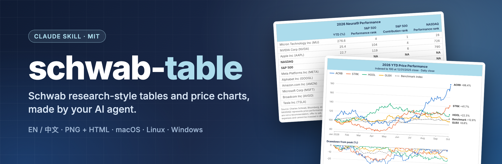
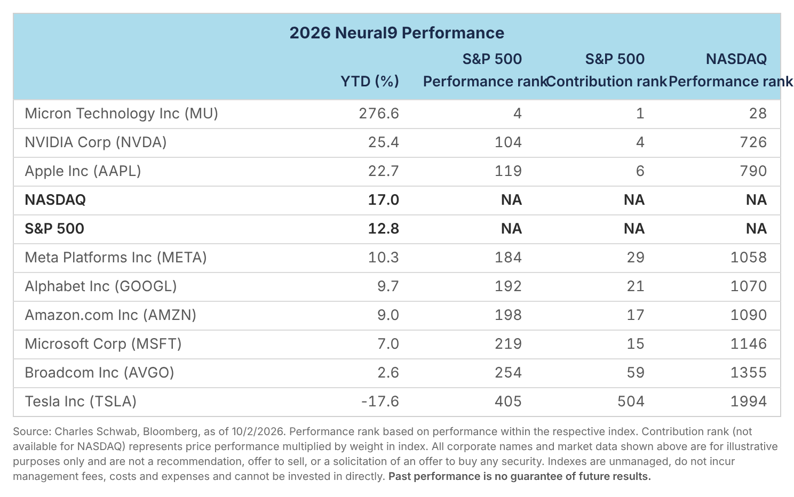
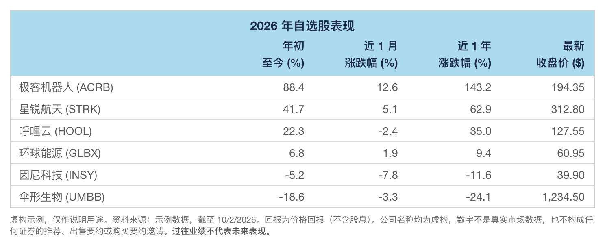
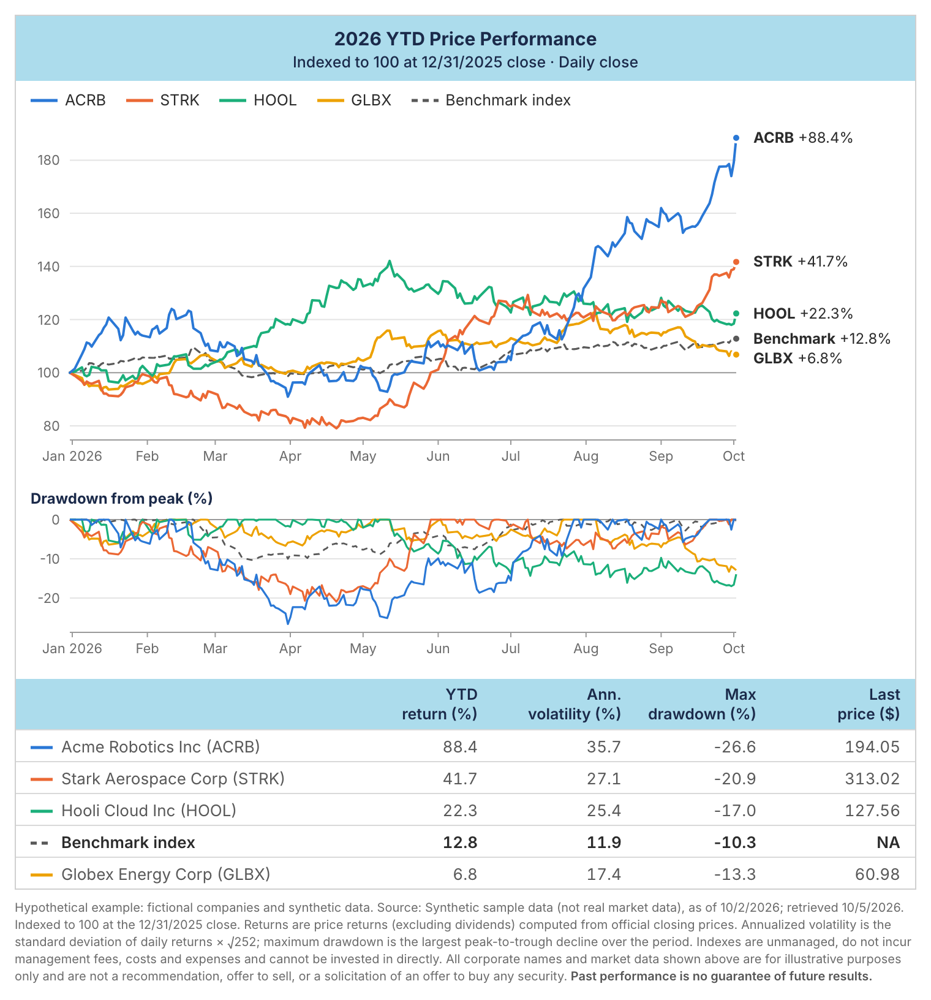
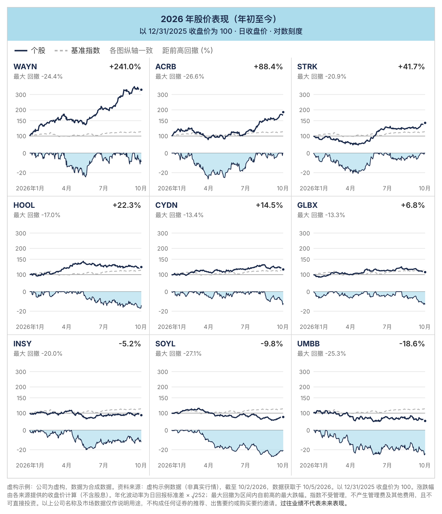
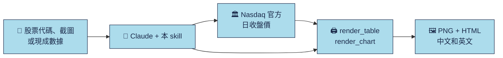

<div align="center">



**給 AI Agent 用的研報風格表格與走勢圖。**

[English](README.md) · **簡體中文** · [日本語](README.ja.md) · [Français](README.fr.md)

<p><a href="LICENSE"></a> <a href="https://github.com/imoneys10k/schwab-table/actions/workflows/install-test.yml"></a> <a href="https://github.com/imoneys10k/schwab-table/releases"></a> <a href="https://github.com/imoneys10k/schwab-table/stargazers"></a> <a href="https://github.com/imoneys10k/schwab-table/actions/workflows/tests.yml"></a>   </p>

<p><a href="#-安裝"><b>🚀 安裝</b></a> · <a href="#-效果圖"><b>🎨 效果圖</b></a> · <a href="https://imoneys10k.github.io/schwab-table/"><b>🌐 項目主頁</b></a> · <a href="SKILL.en.md"><b>📘 Skill 文檔</b></a></p>

</div>

一個 Claude Skill：把股票清單、券商持倉截圖或現成的漲跌幅/排名數據，做成 Charles Schwab 研報風格的業績表；還能用同樣的風格畫出若干標的在任意時間段內的走勢圖。全部同時輸出中文版和英文版（PNG + HTML）。

## ✨ 亮點

<table>
<tr><td width="50%" valign="top"><h3>🎯 研報風格</h3><p>淺藍標題帶、灰色細線、小字腳註，和券商研報裏的表格一個味道。</p></td><td width="50%" valign="top"><h3>📊 表格加走勢圖</h3><p>排名表、持倉表、自選股表，以及帶回撤和對數刻度的線圖、小圖矩陣。</p></td></tr>
<tr><td width="50%" valign="top"><h3>🌏 默認中英雙版</h3><p>每次都輸出中文和英文兩版：2x PNG 加獨立的 HTML。</p></td><td width="50%" valign="top"><h3>🔒 來源明確</h3><p>交易所收盤價與明確標註的 Yahoo 全球行情。缺的數據寫 NA，絕不編造。</p></td></tr>
<tr><td width="50%" valign="top"><h3>🤖 一句話讓 Agent 安裝</h3><p>把提示詞發給 Claude Code 或 Codex 就行，支持 macOS、Linux、Windows。</p></td><td width="50%" valign="top"><h3>🔤 隨附報表字體</h3><p>附帶 Inter、Source Sans 3 與 Droid Sans；原件字體的替換差異已明示。</p></td></tr>
</table>

## 🎨 效果圖

<table>
<tr><td width="50%" align="center"><br><sub><b>排名表</b> · EN</sub></td><td width="50%" align="center"><br><sub><b>自選股表</b> · 中文</sub></td></tr>
<tr><td width="50%" align="center"><br><sub><b>帶回撤的線圖</b> · EN</sub></td><td width="50%" align="center"><br><sub><b>小圖矩陣（對數刻度）</b> · 中文</sub></td></tr>
</table>

<sub>除排名表（來自 Charles Schwab 公開圖表）外，示例都使用虛構公司和合成數據。</sub>

## 🔄 工作流程



## 機構報表版式

正式版提供四種版式：Schwab（預設）、摩根士丹利回報／風險矩陣、黑石分組業績、IBKR持倉／敞口明細。
**所有中文表格與圖表預設繁體中文**，既有 `zh` 輸入鍵與 `_zh` 檔名保持相容。

| 版式 | 示例 | 用途 |
| --- | --- | --- |
| `schwab` | [自選股](examples/watchlist_zh.png) | 原有排名、自選股、盈虧表 |
| `morgan` | [回報與風險矩陣](examples/morgan_zh.png) | 兩個期間，各含回報、波動率與最大回撤 |
| `blackstone` | [分組業績](examples/blackstone_zh.png) | 行業／策略分組、兩個回報期間 |
| `ibkr` | [持倉明細](examples/ibkr_zh.png) | 券商字段、市值、權重與明確提供的敞口 |

```bash
python3 render_table.py examples/morgan_spec.json out/matrix
python3 render_table.py examples/blackstone_spec.json out/grouped
python3 render_table.py examples/ibkr_spec.json out/holdings
python3 prices_to_table.py data/prices.json data/matrix.json --style morgan
python3 render_table.py data/matrix.json out/matrix
```

各模板使用自己的字段結構，不會將五欄自選股的缺失資料補成七欄或九欄財務數字。
詳見[模板結構、原件參考與字體差異](references/institutional-tables.md)。新模板以白底報表校準；
Schwab表格與圖表保留淺色／深色模式。示例公司與數值均為虛構。

## 🚀 安裝

支持 macOS、Linux 和 Windows。需要 Python 3.9+（用於渲染表格），git 可選。

💡 **最省事的辦法：** 把下面的提示詞直接發給你的 AI Agent，它會替你裝好。

### 🤖 讓 AI Agent 幫你安裝

把下面這段話直接發給 Claude Code、Codex 或其他編程 Agent：

```text
請幫我安裝 https://github.com/imoneys10k/schwab-table 這個 skill。
先判斷我的操作系統。macOS 或 Linux 運行：
  curl -fsSL https://raw.githubusercontent.com/imoneys10k/schwab-table/main/install.sh | sh
Windows 在 PowerShell 裏運行：
  irm https://raw.githubusercontent.com/imoneys10k/schwab-table/main/install.ps1 | iex
如果我用的不是 Claude，請裝到那個 Agent 自己的 skills 目錄
（macOS/Linux 在 `sh -s --` 後面加 `--dir <路徑>`；Windows 先保存 install.ps1，再用 -Dir <路徑> 運行）。
裝完確認輸出了 "Render OK"，然後提醒我重啓，讓 skill 生效。
```

### 💻 或者自己運行

macOS / Linux：

```bash
curl -fsSL https://raw.githubusercontent.com/imoneys10k/schwab-table/main/install.sh | sh
```

Windows（PowerShell）：

```powershell
irm https://raw.githubusercontent.com/imoneys10k/schwab-table/main/install.ps1 | iex
```

安裝腳本會把 skill 放進 `~/.claude/skills/schwab-performance-table`（Windows 爲 `%USERPROFILE%\.claude\skills\...`），在裏面創建獨立的 Python 虛擬環境，安裝 Playwright 和 Chromium（約 100 MB），再渲染一張示例表做冒煙測試。一切正常時會輸出 `Render OK`。裝完重啓 Claude，skill 纔會被加載。想先看腳本內容，可以打開 [install.sh](install.sh) 或 [install.ps1](install.ps1)。

| 選項（macOS / Linux） | 選項（Windows） | 作用 |
|---|---|---|
| `--dir PATH` | `-Dir PATH` | 裝到別處（比如其他 Agent 的 skills 目錄）。環境變量 `CLAUDE_SKILLS_DIR` 可修改默認根目錄 |
| `--ref TAG` | `-Ref TAG` | 安裝指定的標籤或分支而不是 `main`，例如 `v0.4.0`，用來固定版本；不帶它再運行一次就會回到 `main` |
| `--skip-deps` | `-SkipDeps` | 跳過 Python / Playwright / Chromium，只下載文件 |
| `--uninstall` | `-Uninstall` | 刪除已安裝的 skill 文件夾 |

用管道運行時，選項要放在 `sh -s --` 後面，例如 `curl -fsSL .../install.sh | sh -s -- --dir ~/my-skills/schwab`。Windows 請先保存 `install.ps1`，再運行 `.\install.ps1 -Dir C:\path`。

**更新：** 再運行一遍同樣的命令。**卸載：** 加上 `--uninstall` 運行（Windows 用 `-Uninstall`）。

**常見問題：** Debian/Ubuntu 需要先裝 `python3-venv`；Linux 上 Chromium 啓動失敗時，運行 `sudo <安裝目錄>/.venv/bin/python -m playwright install-deps chromium`。

## 💬 在 Claude 裏使用

安裝後直接用自然語言說就行，例如：

- 幫我給 NVDA、AMD、MU 做個業績表。
- 把這張持倉截圖做成 Schwab 風格的表。（附上截圖）
- 用這份數據做一張 2026 年 Neural9 排名表。
- 幫我畫 NVDA、MU、AAPL 今年的走勢圖。
- 把這六隻股票 3 月到 6 月的走勢用對數刻度對比一下。

## 🧩 三種模式

| 模式 | 輸入 | 第 2–5 列 | 示例 |
|---|---|---|---|
| A 排名表 | 每隻股票的 YTD 和 S&P 500 / NASDAQ 內排名 | YTD、S&P 500 漲幅排名、S&P 500 貢獻排名、NASDAQ 漲幅排名 | [EN](examples/neural9_en.png) · [中文](examples/neural9_zh.png) |
| B 持倉表 | 券商持倉截圖或導出 | 開倉盈虧 %、當日盈虧、平均成本、持股數 | [EN](examples/holdings_en.png) · [中文](examples/holdings_zh.png) |
| C 自選股表 | 只有股票代碼 | 年初至今、近 1 月、近 1 年、最新收盤價 | [EN](examples/watchlist_en.png) · [中文](examples/watchlist_zh.png) |

模式 A 的數據來自 Charles Schwab 公開圖表；模式 B、C 的示例使用虛構公司和編造數字，僅作演示。

## 📊 走勢圖

最多 9 只標的、任意時間段（默認年初至今），同樣的研報風格，帶回撤面板和彙總表，中英雙版（PNG + HTML）。示例使用虛構公司和合成數據。

| 版式 | 內容 | 適用 |
|---|---|---|
| `lines` | 折線圖、回撤面板、彙總表 | 2–5 只 |
| `multiples` | 每隻一個小圖，同一縱軸，下方帶回撤條 | 6–9 只 |

`layout: auto` 會按標的數量自動選擇。

- **數據：** 美股使用 Nasdaq；滬深 A 股使用交易所官網日線（未復權）；其他市場使用 Yahoo Finance 聚合行情。保留各幣種、最後交易日與來源。默認基準仍爲 SPY，全球圖無基準時用 `--benchmark none`。
- **縱軸：** 只有一個縱軸，起點爲 100。漲幅差距很大時自動改用對數刻度（也可用 `y_scale` 手動指定）。
- **自己的數據：** `csv_to_prices.py` 可以把 CSV 文件（券商導出、港股或 A 股價格、用於總回報的復權價）轉成同樣的格式。
- **選項：** `--theme dark` 深色主題、`--pdf` 矢量 PDF、多個基準（`--benchmark SPY,COMP`）、自定義線條顏色，HTML 文件裏還有鼠標懸停提示。

```bash
python3 fetch_prices.py NVDA MU AAPL --start 2026-01-01 -o data/watch.json
python3 fetch_prices.py 7203.T 0700.HK SAP.DE 600519.SS 000001.SZ --start 2026-08-01 --benchmark none -o data/global.json
python3 render_chart.py examples/chart_lines_spec.json out/chart   # copy and edit the spec for your own data
```

## 🔍 數據源

美股與滬深行情優先交易所來源，全球日線允許使用明確標註的 Yahoo Finance 聚合行情；公司 IR、SEC 與指數官方來源規則繼續保留。滬深官網價格未復權，深交所歷史窗口有限；歷史不足會報錯，不會縮短區間冒充完整回報。詳見 [SKILL.md](SKILL.md)。

<details>
<summary><b>📁 文件</b></summary>

- `SKILL.md`：Claude 實際加載的 Skill 說明（結構、視覺參數、數據源規定、自查清單）
- `SKILL.en.md`：`SKILL.md` 的英文譯本，供人閱讀
- `install.sh` / `install.ps1`：一鍵安裝腳本（macOS / Linux 與 Windows）
- `render_table.py`：表格渲染器，讀 JSON spec，輸出中英文 HTML 和 2x PNG
- `fetch_prices.py`：自動按市場取日線：Nasdaq、滬深交易所官網、Yahoo（僅用標準庫）
- `csv_to_prices.py`：把你自己的 CSV 價格文件轉成 `render_chart.py` 能讀的格式
- `render_common.py`：共用的配色主題和 PNG / PDF 渲染
- `tests/`：計算和解析邏輯的單元測試（`python3 -m unittest discover -s tests`）
- `evals/`：貼近真實使用的測試請求、觸發測試集，以及第一輪評測結果
- `render_chart.py`：走勢圖渲染器，讀取下載的價格和 JSON spec
- `fonts.py`、`fonts/`：隨倉庫附帶的 Inter 字體（SIL OFL），嵌入每個 HTML 文件
- `requirements.txt`：Python 依賴（Playwright）
- `examples/`：三種表格模式和兩種圖表版式各一份 spec 和渲染結果（`sample_prices.json` 爲合成數據）
- `assets/`：社交預覽圖

</details>

<details>
<summary><b>🔧 手動渲染</b></summary>

如果用安裝腳本裝的，`render_table.py` 會自動切換到它的虛擬環境，直接 `python3 render_table.py ...` 就行。否則需要 Python 3.9 及以上：

```bash
pip install -r requirements.txt && playwright install chromium
python3 render_table.py examples/neural9_spec.json out/neural9
```

可選參數（兩個渲染器通用）：`--langs en` 只渲染指定語言（逗號分隔）；`--no-png` 只寫 HTML，不需要 Playwright；`--scale 3` 提高 PNG 清晰度（默認 2，即 1520 px 寬）。輸出目錄不存在時會自動創建。

走勢圖分兩步：先下載價格，再渲染。用 `--start` / `--end` 指定時間段，默認年初至今；`--benchmark COMP` 可把基準從 SPY 換成納斯達克綜合指數。

```bash
python3 fetch_prices.py NVDA MU AAPL --start 2026-01-01 -o data/watch.json
python3 fetch_prices.py 7203.T 0700.HK SAP.DE 600519.SS 000001.SZ --start 2026-08-01 --benchmark none -o data/global.json
python3 render_chart.py examples/chart_lines_spec.json out/chart   # 複製並修改 spec 用於你自己的數據
python3 render_chart.py examples/chart_lines_spec.json out/chart --theme dark --pdf   # 深色主題和矢量 PDF
python3 csv_to_prices.py 0700.HK=tencent.csv --benchmark HSI=hsi.csv -o data/hk.json   # 你自己的 CSV 文件
```

`fetch_prices.py` 會把響應緩存 12 小時（`--refresh` 可繞過緩存），網絡失敗時會帶警告地使用上一次的緩存。代碼有歧義時，可用 `index:COMP`、`etf:SPY` 指定資產類別。兩個渲染器都支持 `--theme dark` 和 `--pdf`。

字體：附帶並嵌入 Inter、Source Sans 3 與 Droid Sans，用於拉丁文字及數字。原件字體替換及繁體中文字體的回退規則見[模板說明](references/institutional-tables.md)。精簡 Linux 系統可安裝 `fonts-noto-cjk`；不隨套件分發原件專用字體或 macOS 字體檔案。

</details>

## 📌 免責聲明

本項目只生成表格樣式，不提供任何投資建議。表中數據僅作示例。

## 📄 許可證

[MIT](LICENSE)

<div align="center"><sub>⭐ 如果它幫你省了時間，點個 star 能讓更多人看到。</sub></div>


## 季度財報研究 · HSBC 版式

v0.6.0 新增 **quarterly-earnings-review**，安裝器會在主 Skill 同層註冊，共用 Python 依賴。可直接輸入：「幫我看看 FY2025Q3 的 AAPL 財報，用 HSBC 表。」核對公司財季與官方原件，計算單季／同比／環比，加入有來源支持的研究評論，預設繁體中文及英文 PNG／HTML。

[兩個季度的線上示例](https://imoneys10k.github.io/schwab-table/earnings/) · [用法與來源範圍](EARNINGS.md) · [Skill](skills/quarterly-earnings-review/SKILL.md)。

```bash
python3 quarterly_earnings.py AAPL --period FY2025Q3 -o out/aapl_q3
```

AAPL 使用 Apple 官方 PDF，已即時驗證；其他 US-GAAP 公司使用 SEC Company Facts，可能遇到存取拒絕，解析已以固定資料驗證。其他市場可透過 `--facts` 匯入核實的官方財報。缺失保留 NA，全年與累計值不冒充單季，未取得一致預期時不宣稱超／低於預期。來源時間、離線示例及評論 JSON 見 EARNINGS.md。
